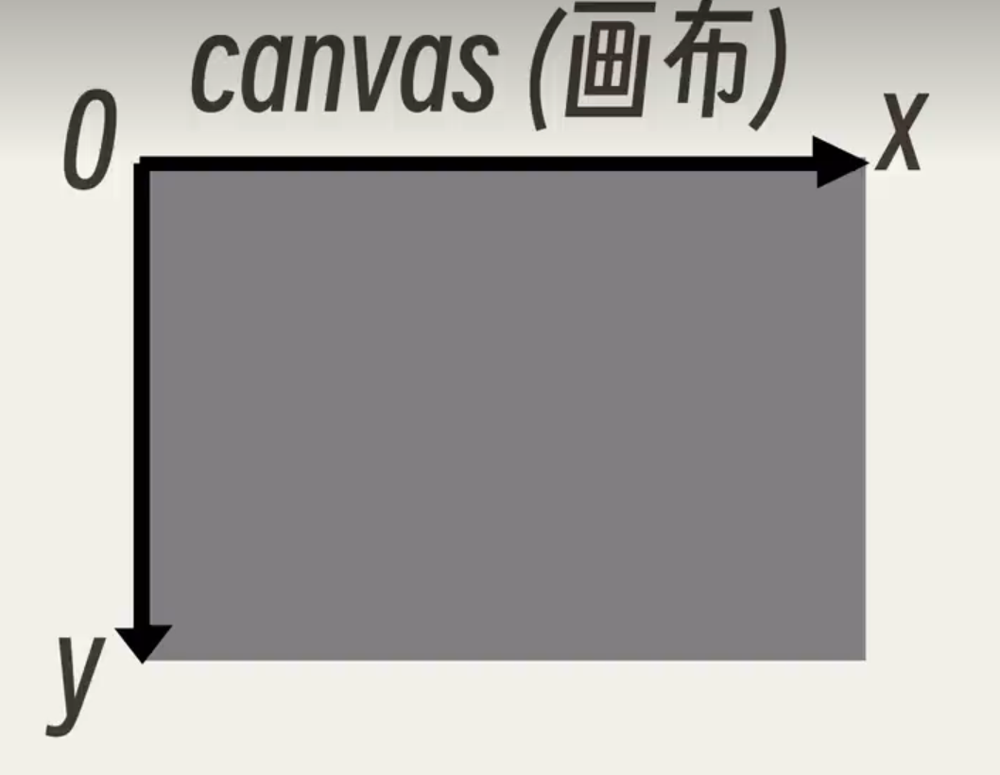

## canvas入门

### 坐标系




### 画直线

**相关代码**

```html
<body>
    <canvas class="canvas" width="500px" height="500px"></canvas>

    <script>
        let canvas = document.querySelector('.canvas');
        let ctx = canvas.getContext("2d");
        //开始一条新的路径，也就是开始画画了。
        ctx.beginPath();
        //
        ctx.moveTo(100,100);
        ctx.lineTo(200,200);
        ctx.lineTo(300,200);
        ctx.lineTo(100,100);
        //让直线有轮廓，也就是描边
        ctx.stroke();
        
    </script>
</body>
```

**运行结果**


### 画矩形

**相关代码**

```html
<body>
    <canvas class="canvas" width="500px" height="500px"></canvas>

    <script>
        let canvas = document.querySelector('.canvas');
        let ctx = canvas.getContext("2d");
        //开始一条新的路径，也就是开始画画了。
        ctx.beginPath();
        //10是x坐标，0是y坐标，100表示长，200表示宽
        ctx.fillRect(10,0,100,200);
        //参数位置和上面一样
        ctx.clearRect(50,50,10,10);
        
    </script>
</body>
```

**运行结果**


### 画圆形

**画圆形的方向**


**相关代码**

```html
<body>
    <canvas class="canvas" width="500px" height="500px"></canvas>

    <script>
        let canvas = document.querySelector('.canvas');
        let ctx = canvas.getContext("2d");
        //开始一条新的路径，也就是开始画画了。
        ctx.beginPath();
        //100,100 是圆心 50是半径 0是起始角度，50是最终角度。true表示从逆时针开始画,false表示从顺时针开始画。
        ctx.arc(100,100,50,0,Math.PI,true);
        ctx.stroke();
    </script>
</body>
```

**运行结果**

