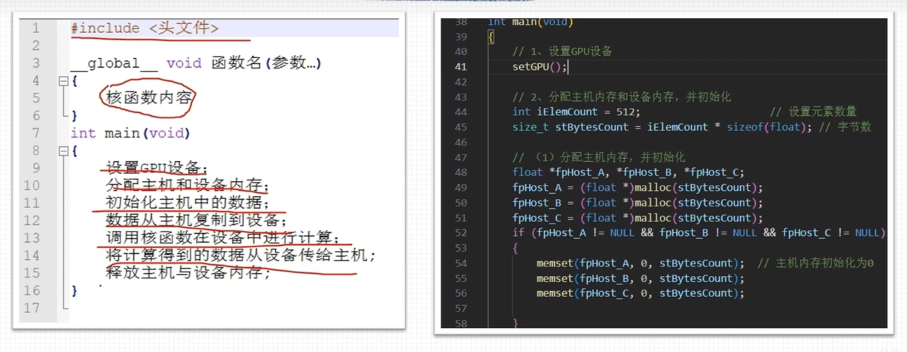

# 第一章

## 一、GPU硬件

### 1、什么是GPU

​		GPU 意为图形处理器，也常被称为显卡，GPU最早主要是进行图形处理的。GPU拥有更多的运算核心，其特别适合数据并行的计算密集型任务，如大型矩阵运算，与GPU对应的一个概念是CPU，但CPU的运算核心较少，但是其可以实现复杂的逻辑运算。


### 2、GPU性能

主要GPU性能指标：

1. 核心数量：为GPU提供计算能力的硬件单元，核心数量越多，可并行运算的线程越多，计算的峰值越高；
2. GPU显存容量：显存容量决定着显存临时存储数据的多少，大显存能减少读取数据的次数，降低延迟，可类比CPU的内存；
3. GPU计算峰值：每块显卡都会给出显卡的GPU计算峰值，这是一个理论值，代表GPU的最大计算能力，一般实际运行是达不到这个数值的；
4. 显存带宽：GPU包含运算单元和显存，显存带宽就是运算单元和显存之间的通信速率，显存带宽越大，代表数据交换的速度越快，性能越高。


## 二、CPU+GPU架构

GPU不能单独进行工作，GPU相当于CPU的协处理器（意思就是cpu是一把手，gpu是二把手）。CPU比较擅长逻辑运算，但是不擅长数据运算。GPU比较擅长数据运算，但是不擅长逻辑运算。


由这个图可以看出，一个GPU具有较多的算术逻辑单元，CPU具有较少的算术逻辑单元。所以GPU可以进行大量的数据运算。

CPU和GPU都有自己的DRAM（dynamic random-access memory，动态随机存取内存），它们之间一般由PCIe总线（peripheral component interconnect express bus）连接。

通常将起控制作用的 CPU 称为主机（host），将起加速作用的 GPU 称为设备（device）。**所以在今后，说到主机就是指CPU，说到设备就是指GPU。**


##　三、CUDA介绍

### 1、什么是CUDA

CUDA是建立在NVIDIA的GPU上的一个通用并行计算平台和编程模型。换句话来说，就是运行在GPU上的应用程序。


### 2、CUDA编程语言

官方语言采用了c++编程语言。


### 3、CUDA运行时API

CUDA提供两层API接口，CUDA驱动(driver)API和CUDA运行时(runtime)API。


## 四、第一个CUDA程序

### 1、第一个CUDA程序

```c++
#include <stdio.h>

//CPU调用核函数，核函数在GPU上执行。
__global__ void hello(){
  int Idx = threadIdx.x + blockIdx.x * blockDim.x;
  printf("Hello world from block %d, thread %d ,global id %d\n", blockIdx.x, threadIdx.x,Idx);
}

int main(){
  hello<<<2, 4>>>();   //1表示的是线程块，5表示的是线程块里里的线程数
  cudaDeviceSynchronize(); //起到一个同步的作用，确保GPU上的计算完成，然后再返回到CPU上。
  return 0;
}
```

### 2、编译和运行

```
nvcc helloworld.cu -o test   //把helloworld.cu编译成test.exe
./test //运行test.exe
```

### 3、运行结果


## 五、nvidia-smi命令

### 1、命令

```
nvidia-smi //通过该命令可以查看gpu版本和cuda版本和正在GPU上运行的CUDA编程。
```


# 第二章

## 一、c++中的helloworld

编译：

```
g++ hello.cpp -o hello
```

运行：

```
./hello.exe
```


## 二、cuda中的helloworld

编译：

```
nvcc hello.cu -o hello
```

运行：

```
./hello.exe
```


## 三、核函数

1. 核函数在GPU上进行并行执行
2. 限定词__global__ 修饰
3. 返回值必须是void

## 四、CUDA程序举例


## 五、cuda线程模型结构


## 六、线程全局索引计算

### 1、全局索引计算


### 2、不同组合方式


## 七、nvcc编译流程

nvcc先将设备代码编译为PTX（Parallel Thread Execution）伪汇编代码，再将PTX代码编译为 

二进制的cubin目标代码。


## 八、GPU架构与计算能力


**补充：并非GPU 的计算能力越高，性能就越高。**


## 九、指定虚拟架构计算能力


**命令行**

```
nvcc helloworld.cu -o helloworld -arch=compute_61
```


## 十、指定真实架构计算能力


**命令行**

```
nvcc helloworld.cu -o helloworld -arch=compute_61 -code=sm_62
```


## 十一、指定多个GPU版本编译


**命令行**

```
nvcc helloworld.cu -o helloworld -gencode=arch=compute_50,code=sm_50
```


## 十二、nvcc即时编译

补充：NVCC（NVIDIA CUDA 编译器）的即时编译（Just-In-Time Compilation，JIT）是一种编译策略，它允许CUDA程序在运行时进行编译。这意味着，当你运行一个CUDA程序时，NVCC会即时将源代码编译成GPU可以执行的机器码。


## 十三、nvcc编译默认计算能力


补充：默认计算能力也就是真实架构的计算能力。


# 第三章

## 一、CUDA程序的基本框架

### 1、cuda程序基本框架



### 2、设置GPU设备

```c++
#include<stdio.h>

int main(){
    //检测计算机cpu的数量
    int iDeviceCount = 0;
    cudaError_t error = cudaGetDeviceCount(&iDeviceCount);
    
    if(error!=cudaSuccess||iDeviceCount==0){
        printf("No CUDA GPU found\n");
        exit(-1);
    }
    else{
        printf("The number of CUDA GPU is %d\n",iDeviceCount);
    }

    //设置几号GPU执行
    int iDev = 0;
    error = cudaSetDevice(iDev);
    if(error!=cudaSuccess) {
        printf("fail to set a gpu computing\n");
        exit(-1);
    }
    else{
        printf("set gpu computing successfully\n");
    }

    return 0;

}
```


## 二、设置CPU设备

### 1、内存管理


### 相关代码

setDevice.cu

```c++
#include <stdio.h>


int main(void)
{
    // 检测计算机GPU数量
    int iDeviceCount = 0;
    cudaError_t error = cudaGetDeviceCount(&iDeviceCount);

    if (error != cudaSuccess || iDeviceCount == 0)
    {
        printf("No CUDA campatable GPU found!\n");
        exit(-1);
    }
    else
    {
        printf("The count of GPUs is %d.\n", iDeviceCount);
    }
    
    // 设置执行
    int iDev = 0;
    error = cudaSetDevice(iDev);
    if (error != cudaSuccess)
    {
        printf("fail to set GPU 0 for computing.\n");
        exit(-1);
    }
    else
    {
        printf("set GPU 0 for computing.\n");
    }

    return 0;
}
```

## 三、内存管理

### 1、一维数组运算

common.cuh

```c++
#include<stdio.h>

void setGPU(){
    //检测计算机cpu的数量
    int iDeviceCount = 0;
    cudaError_t error = cudaGetDeviceCount(&iDeviceCount);
    
    if(error!=cudaSuccess||iDeviceCount==0){
        printf("No CUDA GPU found\n");
        exit(-1);
    }
    else{
        printf("The number of CUDA GPU is %d\n",iDeviceCount);
    }

    //设置几号GPU执行
    int iDev = 0;
    error = cudaSetDevice(iDev);
    if(error!=cudaSuccess) {
        printf("fail to set a gpu computing\n");
        exit(-1);
    }
    else{
        printf("set gpu computing successfully\n");
    }

}
```


matrixSum1D_GPU.cu

```c++
/*********************************************************
 * brief      : 矩阵求和程序，通过调用核函数在GPU执行
**********************************************************/

#include <stdio.h>
#include "./tools/common.cuh"

__global__ void addFromGPU(float *A, float *B, float *C, const int N)
{
    const int bid = blockIdx.x;
    const int tid = threadIdx.x;
    const int id = tid + bid * blockDim.x; 

    C[id] = A[id] + B[id];
    
}

void initialData(float *addr, int elemCount)
{
    for (int i = 0; i < elemCount; i++)
    {
        addr[i] = (float)(rand() & 0xFF) / 10.f;
    }
    return;
}

int main(void)
{
    // 1、设置GPU设备
    setGPU();

    // 2、分配主机内存和设备内存，并初始化
    int iElemCount = 512;                               // 设置元素数量
    size_t stBytesCount = iElemCount * sizeof(float);   // 字节数
    
    // （1）分配主机内存，并初始化
    float *fpHost_A, *fpHost_B, *fpHost_C;
    fpHost_A = (float *)malloc(stBytesCount);
    fpHost_B = (float *)malloc(stBytesCount);
    fpHost_C = (float *)malloc(stBytesCount);
    if (fpHost_A != NULL && fpHost_B != NULL && fpHost_C != NULL)
    {
        memset(fpHost_A, 0, stBytesCount);  // 主机内存初始化为0
        memset(fpHost_B, 0, stBytesCount);
        memset(fpHost_C, 0, stBytesCount);
    }
    else
    {
        printf("Fail to allocate host memory!\n");
        exit(-1);
    }

    // （2）分配设备内存，并初始化
    float *fpDevice_A, *fpDevice_B, *fpDevice_C;
    cudaMalloc((float**)&fpDevice_A, stBytesCount);
    cudaMalloc((float**)&fpDevice_B, stBytesCount);
    cudaMalloc((float**)&fpDevice_C, stBytesCount);
    if (fpDevice_A != NULL && fpDevice_B != NULL && fpDevice_C != NULL)
    {
        cudaMemset(fpDevice_A, 0, stBytesCount);  // 设备内存初始化为0
        cudaMemset(fpDevice_B, 0, stBytesCount);
        cudaMemset(fpDevice_C, 0, stBytesCount);
    }
    else
    {
        printf("fail to allocate memory\n");
        free(fpHost_A);
        free(fpHost_B);
        free(fpHost_C);
        exit(-1);
    }

    // 3、初始化主机中数据
    srand(666); // 设置随机种子
    initialData(fpHost_A, iElemCount);
    initialData(fpHost_B, iElemCount);
    
    // 4、数据从主机复制到设备
    cudaMemcpy(fpDevice_A, fpHost_A, stBytesCount, cudaMemcpyHostToDevice); 
    cudaMemcpy(fpDevice_B, fpHost_B, stBytesCount, cudaMemcpyHostToDevice); 
    cudaMemcpy(fpDevice_C, fpHost_C, stBytesCount, cudaMemcpyHostToDevice);


    // 5、调用核函数在设备中进行计算
    dim3 block(32);
    dim3 grid(iElemCount / 32);

    addFromGPU<<<grid, block>>>(fpDevice_A, fpDevice_B, fpDevice_C, iElemCount);    // 调用核函数
    //同步函数
    cudaDeviceSynchronize();
    //调用了该函数，cpu就会等待gpu执行完毕，再继续执行

    // 6、将计算得到的数据从设备传给主机
    cudaMemcpy(fpHost_C, fpDevice_C, stBytesCount, cudaMemcpyDeviceToHost);


    for (int i = 0; i < 10; i++)    // 打印
    {
        printf("idx=%2d\tmatrix_A:%.2f\tmatrix_B:%.2f\tresult=%.2f\n", i+1, fpHost_A[i], fpHost_B[i], fpHost_C[i]);
    }

    // 7、释放主机与设备内存
    free(fpHost_A);
    free(fpHost_B);
    free(fpHost_C);
    cudaFree(fpDevice_A);
    cudaFree(fpDevice_B);
    cudaFree(fpDevice_C);

    cudaDeviceReset();
    return 0;
}
```


## 四、cuda错误检查

### 1、错误检测函数

common.cuh

```
#include <stdlib.h>
#include <stdio.h>

cudaError_t ErrorCheck(cudaError_t error_code, const char* filename, int lineNumber)
{
    if (error_code != cudaSuccess)
    {
        printf("CUDA error:\r\ncode=%d, name=%s, description=%s\r\nfile=%s, line%d\r\n",
                error_code, cudaGetErrorName(error_code), cudaGetErrorString(error_code), filename, lineNumber);
        return error_code;
    }
    return error_code;
}
```


errorCheckFunction.cu

```c++
#include <stdio.h>
#include "./tools/common.cuh"


int main(void)
{
    // 1、分配主机内存，并初始化
    float *fpHost_A;
    fpHost_A = (float *)malloc(4);
    memset(fpHost_A, 0, 4);  // 主机内存初始化为0
    
    float *fpDevice_A;
    cudaError_t error = ErrorCheck(cudaMalloc((float**)&fpDevice_A, 4), __FILE__, __LINE__);
    cudaMemset(fpDevice_A, 0, 4);  // 设备内存初始化为0

    // 2、数据从主机复制到设备
    ErrorCheck(cudaMemcpy(fpDevice_A, fpHost_A, 4, cudaMemcpyDeviceToHost), __FILE__, __LINE__); 
    
    // 3、释放主机与设备内存
    free(fpHost_A);  
    ErrorCheck(cudaFree(fpDevice_A), __FILE__, __LINE__);
    
    ErrorCheck(cudaDeviceReset(), __FILE__, __LINE__);
    return 0;
}
```

### 2、核函数的错误检测

common.cuh

```c++
#include <stdlib.h>
#include <stdio.h>

cudaError_t ErrorCheck(cudaError_t error_code, const char* filename, int lineNumber)
{
    if (error_code != cudaSuccess)
    {
        printf("CUDA error:\r\ncode=%d, name=%s, description=%s\r\nfile=%s, line%d\r\n",
                error_code, cudaGetErrorName(error_code), cudaGetErrorString(error_code), filename, lineNumber);
        return error_code;
    }
    return error_code;
}

void setGPU(){
    //检测计算机cpu的数量
    int iDeviceCount = 0;
    cudaError_t error = cudaGetDeviceCount(&iDeviceCount);
    
    if(error!=cudaSuccess||iDeviceCount==0){
        printf("No CUDA GPU found\n");
        exit(-1);
    }
    else{
        printf("The number of CUDA GPU is %d\n",iDeviceCount);
    }

    //设置几号GPU执行
    int iDev = 0;
    error = cudaSetDevice(iDev);
    if(error!=cudaSuccess) {
        printf("fail to set a gpu computing\n");
        exit(-1);
    }
    else{
        printf("set gpu computing successfully\n");
    }

}
```

errorCheckKernel.cu

```c++
#include <stdio.h>
#include "./tools/common.cuh"

__device__ float add(const float x, const float y)
{
    return x + y;
}

__global__ void addFromGPU(float *A, float *B, float *C, const int N)
{
    const int bid = blockIdx.x;
    const int tid = threadIdx.x;
    const int id = tid + bid * blockDim.x; 

    if (id >= N) return;
    C[id] = add(A[id], B[id]);
    
}


void initialData(float *addr, int elemCount)
{
    for (int i = 0; i < elemCount; i++)
    {
        addr[i] = (float)(rand() & 0xFF) / 10.f;
    }
    return;
}


int main(void)
{
    // 1、设置GPU设备
    setGPU();

    // 2、分配主机内存和设备内存，并初始化
    int iElemCount = 4096;                     // 设置元素数量
    size_t stBytesCount = iElemCount * sizeof(float); // 字节数
    
    // （1）分配主机内存，并初始化
    float *fpHost_A, *fpHost_B, *fpHost_C;
    fpHost_A = (float *)malloc(stBytesCount);
    fpHost_B = (float *)malloc(stBytesCount);
    fpHost_C = (float *)malloc(stBytesCount);
    if (fpHost_A != NULL && fpHost_B != NULL && fpHost_C != NULL)
    {
        memset(fpHost_A, 0, stBytesCount);  // 主机内存初始化为0
        memset(fpHost_B, 0, stBytesCount);
        memset(fpHost_C, 0, stBytesCount);
    
    }
    else
    {
        printf("Fail to allocate host memory!\n");
        exit(-1);
    }


    // （2）分配设备内存，并初始化
    float *fpDevice_A, *fpDevice_B, *fpDevice_C;
    cudaMalloc((float**)&fpDevice_A, stBytesCount);
    cudaMalloc((float**)&fpDevice_B, stBytesCount);
    cudaMalloc((float**)&fpDevice_C, stBytesCount);
    if (fpDevice_A != NULL && fpDevice_B != NULL && fpDevice_C != NULL)
    {
        cudaMemset(fpDevice_A, 0, stBytesCount);  // 设备内存初始化为0
        cudaMemset(fpDevice_B, 0, stBytesCount);
        cudaMemset(fpDevice_C, 0, stBytesCount);
    }
    else
    {
        printf("fail to allocate memory\n");
        free(fpHost_A);
        free(fpHost_B);
        free(fpHost_C);
        exit(-1);
    }

    // 3、初始化主机中数据
    srand(666); // 设置随机种子
    initialData(fpHost_A, iElemCount);
    initialData(fpHost_B, iElemCount);
    
    // 4、数据从主机复制到设备
    cudaMemcpy(fpDevice_A, fpHost_A, stBytesCount, cudaMemcpyHostToDevice); 
    cudaMemcpy(fpDevice_B, fpHost_B, stBytesCount, cudaMemcpyHostToDevice); 
    cudaMemcpy(fpDevice_C, fpHost_C, stBytesCount, cudaMemcpyHostToDevice);


    // 5、调用核函数在设备中进行计算
    dim3 block(2048); 
    dim3 grid((iElemCount + block.x - 1) / 2048); 

    addFromGPU<<<grid, block>>>(fpDevice_A, fpDevice_B, fpDevice_C, iElemCount);    // 调用核函数
    ErrorCheck(cudaGetLastError(), __FILE__, __LINE__);
    ErrorCheck(cudaDeviceSynchronize(), __FILE__, __LINE__);


    // 6、将计算得到的数据从设备传给主机
    cudaMemcpy(fpHost_C, fpDevice_C, stBytesCount, cudaMemcpyDeviceToHost);
  

    for (int i = 0; i < 10; i++)    // 打印
    {
        printf("idx=%2d\tmatrix_A:%.2f\tmatrix_B:%.2f\tresult=%.2f\n", i+1, fpHost_A[i], fpHost_B[i], fpHost_C[i]);
    }

    // 7、释放主机与设备内存
    free(fpHost_A);
    free(fpHost_B);
    free(fpHost_C);
    cudaFree(fpDevice_A);
    cudaFree(fpDevice_B);
    cudaFree(fpDevice_C);

    cudaDeviceReset();
    return 0;
}
```


## 五、CUDA计时

### 1、事件计时

common.cuh

```c++
#include <stdlib.h>
#include <stdio.h>

cudaError_t ErrorCheck(cudaError_t error_code, const char* filename, int lineNumber)
{
    if (error_code != cudaSuccess)
    {
        printf("CUDA error:\r\ncode=%d, name=%s, description=%s\r\nfile=%s, line%d\r\n",
                error_code, cudaGetErrorName(error_code), cudaGetErrorString(error_code), filename, lineNumber);
        return error_code;
    }
    return error_code;
}

void setGPU(){
    //检测计算机cpu的数量
    int iDeviceCount = 0;
    cudaError_t error = cudaGetDeviceCount(&iDeviceCount);
    
    if(error!=cudaSuccess||iDeviceCount==0){
        printf("No CUDA GPU found\n");
        exit(-1);
    }
    else{
        printf("The number of CUDA GPU is %d\n",iDeviceCount);
    }

    //设置几号GPU执行
    int iDev = 0;
    error = cudaSetDevice(iDev);
    if(error!=cudaSuccess) {
        printf("fail to set a gpu computing\n");
        exit(-1);
    }
    else{
        printf("set gpu computing successfully\n");
    }

}
```


eventRecordTime.cu

```c++
#include <stdio.h>
#include "./tools/common.cuh"

#define NUM_REPEATS 10

__device__ float add(const float x, const float y)
{
    return x + y;
}

__global__ void addFromGPU(float *A, float *B, float *C, const int N)
{
    const int bid = blockIdx.x;
    const int tid = threadIdx.x;
    const int id = tid + bid * blockDim.x; 
    if (id >= N) return;
    C[id] = add(A[id], B[id]);
    
}


void initialData(float *addr, int elemCount)
{
    for (int i = 0; i < elemCount; i++)
    {
        addr[i] = (float)(rand() & 0xFF) / 10.f;
    }
    return;
}


int main(void)
{
    // 1、设置GPU设备
    setGPU();

    // 2、分配主机内存和设备内存，并初始化
    int iElemCount = 4096;                     // 设置元素数量
    size_t stBytesCount = iElemCount * sizeof(float); // 字节数
    
    // （1）分配主机内存，并初始化
    float *fpHost_A, *fpHost_B, *fpHost_C;
    fpHost_A = (float *)malloc(stBytesCount);
    fpHost_B = (float *)malloc(stBytesCount);
    fpHost_C = (float *)malloc(stBytesCount);
    if (fpHost_A != NULL && fpHost_B != NULL && fpHost_C != NULL)
    {
        memset(fpHost_A, 0, stBytesCount);  // 主机内存初始化为0
        memset(fpHost_B, 0, stBytesCount);
        memset(fpHost_C, 0, stBytesCount);
    
    }
    else
    {
        printf("Fail to allocate host memory!\n");
        exit(-1);
    }


    // （2）分配设备内存，并初始化
    float *fpDevice_A, *fpDevice_B, *fpDevice_C;
    ErrorCheck(cudaMalloc((float**)&fpDevice_A, stBytesCount), __FILE__, __LINE__);
    ErrorCheck(cudaMalloc((float**)&fpDevice_B, stBytesCount), __FILE__, __LINE__);
    ErrorCheck(cudaMalloc((float**)&fpDevice_C, stBytesCount), __FILE__, __LINE__);
    if (fpDevice_A != NULL && fpDevice_B != NULL && fpDevice_C != NULL)
    {
        ErrorCheck(cudaMemset(fpDevice_A, 0, stBytesCount), __FILE__, __LINE__); // 设备内存初始化为0
        ErrorCheck(cudaMemset(fpDevice_B, 0, stBytesCount), __FILE__, __LINE__);
        ErrorCheck(cudaMemset(fpDevice_C, 0, stBytesCount), __FILE__, __LINE__);
    }
    else
    {
        printf("fail to allocate memory\n");
        free(fpHost_A);
        free(fpHost_B);
        free(fpHost_C);
        exit(-1);
    }

    // 3、初始化主机中数据
    srand(666); // 设置随机种子
    initialData(fpHost_A, iElemCount);
    initialData(fpHost_B, iElemCount);
    
    // 4、数据从主机复制到设备
    ErrorCheck(cudaMemcpy(fpDevice_A, fpHost_A, stBytesCount, cudaMemcpyHostToDevice), __FILE__, __LINE__); 
    ErrorCheck(cudaMemcpy(fpDevice_B, fpHost_B, stBytesCount, cudaMemcpyHostToDevice), __FILE__, __LINE__);
    ErrorCheck(cudaMemcpy(fpDevice_C, fpHost_C, stBytesCount, cudaMemcpyHostToDevice), __FILE__, __LINE__);


    // 5、调用核函数在设备中进行计算
    dim3 block(32);
    dim3 grid((iElemCount + block.x - 1) / 32);

    float t_sum = 0;
    for (int repeat = 0; repeat <= NUM_REPEATS; ++repeat)
    {
        cudaEvent_t start, stop;
        ErrorCheck(cudaEventCreate(&start), __FILE__, __LINE__);
        ErrorCheck(cudaEventCreate(&stop), __FILE__, __LINE__);
        ErrorCheck(cudaEventRecord(start), __FILE__, __LINE__);
        cudaEventQuery(start);	//此处不可用错误检测函数

        addFromGPU<<<grid, block>>>(fpDevice_A, fpDevice_B, fpDevice_C, iElemCount);    // 调用核函数

        ErrorCheck(cudaEventRecord(stop), __FILE__, __LINE__);
        ErrorCheck(cudaEventSynchronize(stop), __FILE__, __LINE__);
        float elapsed_time;
        ErrorCheck(cudaEventElapsedTime(&elapsed_time, start, stop), __FILE__, __LINE__);
        // printf("Time = %g ms.\n", elapsed_time);

        if (repeat > 0)
        {
            t_sum += elapsed_time;
        }

        ErrorCheck(cudaEventDestroy(start), __FILE__, __LINE__);
        ErrorCheck(cudaEventDestroy(stop), __FILE__, __LINE__);
    }

    const float t_ave = t_sum / NUM_REPEATS;
    printf("Time = %g ms.\n", t_ave);

    // 6、将计算得到的数据从设备传给主机
    ErrorCheck(cudaMemcpy(fpHost_C, fpDevice_C, stBytesCount, cudaMemcpyDeviceToHost), __FILE__, __LINE__);

    // 7、释放主机与设备内存
    free(fpHost_A);
    free(fpHost_B);
    free(fpHost_C);
    ErrorCheck(cudaFree(fpDevice_A), __FILE__, __LINE__);
    ErrorCheck(cudaFree(fpDevice_B), __FILE__, __LINE__);
    ErrorCheck(cudaFree(fpDevice_C), __FILE__, __LINE__);

    ErrorCheck(cudaDeviceReset(), __FILE__, __LINE__);
    return 0;
}
```


### 2、nvprof性能分析

```
nvprof ./可执行文件名   //好像有版本限制
```


## 六、运行时API查询GPU信息

### 1、运行时api查询GPU信息

common.cuh

```c++
#include <stdlib.h>
#include <stdio.h>

cudaError_t ErrorCheck(cudaError_t error_code, const char* filename, int lineNumber)
{
    if (error_code != cudaSuccess)
    {
        printf("CUDA error:\r\ncode=%d, name=%s, description=%s\r\nfile=%s, line%d\r\n",
                error_code, cudaGetErrorName(error_code), cudaGetErrorString(error_code), filename, lineNumber);
        return error_code;
    }
    return error_code;
}

void setGPU(){
    //检测计算机cpu的数量
    int iDeviceCount = 0;
    cudaError_t error = cudaGetDeviceCount(&iDeviceCount);
    
    if(error!=cudaSuccess||iDeviceCount==0){
        printf("No CUDA GPU found\n");
        exit(-1);
    }
    else{
        printf("The number of CUDA GPU is %d\n",iDeviceCount);
    }

    //设置几号GPU执行
    int iDev = 0;
    error = cudaSetDevice(iDev);
    if(error!=cudaSuccess) {
        printf("fail to set a gpu computing\n");
        exit(-1);
    }
    else{
        printf("set gpu computing successfully\n");
    }

}
```

query.cu

```c++
#include "./tools/common.cuh"
#include <stdio.h>

int main(void)
{
    int device_id = 0;
    ErrorCheck(cudaSetDevice(device_id), __FILE__, __LINE__);

    cudaDeviceProp prop;
    ErrorCheck(cudaGetDeviceProperties(&prop, device_id), __FILE__, __LINE__);

    printf("Device id:                                 %d\n",
        device_id);
    printf("Device name:                               %s\n",
        prop.name);
    printf("Compute capability:                        %d.%d\n",
        prop.major, prop.minor);
    printf("Amount of global memory:                   %g GB\n",
        prop.totalGlobalMem / (1024.0 * 1024 * 1024));
    printf("Amount of constant memory:                 %g KB\n",
        prop.totalConstMem  / 1024.0);
    printf("Maximum grid size:                         %d %d %d\n",
        prop.maxGridSize[0], 
        prop.maxGridSize[1], prop.maxGridSize[2]);
    printf("Maximum block size:                        %d %d %d\n",
        prop.maxThreadsDim[0], prop.maxThreadsDim[1], 
        prop.maxThreadsDim[2]);
    printf("Number of SMs:                             %d\n",
        prop.multiProcessorCount);
    printf("Maximum amount of shared memory per block: %g KB\n",
        prop.sharedMemPerBlock / 1024.0);
    printf("Maximum amount of shared memory per SM:    %g KB\n",
        prop.sharedMemPerMultiprocessor / 1024.0);
    printf("Maximum number of registers per block:     %d K\n",
        prop.regsPerBlock / 1024);
    printf("Maximum number of registers per SM:        %d K\n",
        prop.regsPerMultiprocessor / 1024);
    printf("Maximum number of threads per block:       %d\n",
        prop.maxThreadsPerBlock);
    printf("Maximum number of threads per SM:          %d\n",
        prop.maxThreadsPerMultiProcessor);

    return 0;
}
```


### 2、查询GPU计算核心数量

common.cuh

```c++
#include <stdlib.h>
#include <stdio.h>

cudaError_t ErrorCheck(cudaError_t error_code, const char* filename, int lineNumber)
{
    if (error_code != cudaSuccess)
    {
        printf("CUDA error:\r\ncode=%d, name=%s, description=%s\r\nfile=%s, line%d\r\n",
                error_code, cudaGetErrorName(error_code), cudaGetErrorString(error_code), filename, lineNumber);
        return error_code;
    }
    return error_code;
}

void setGPU(){
    //检测计算机cpu的数量
    int iDeviceCount = 0;
    cudaError_t error = cudaGetDeviceCount(&iDeviceCount);
    
    if(error!=cudaSuccess||iDeviceCount==0){
        printf("No CUDA GPU found\n");
        exit(-1);
    }
    else{
        printf("The number of CUDA GPU is %d\n",iDeviceCount);
    }

    //设置几号GPU执行
    int iDev = 0;
    error = cudaSetDevice(iDev);
    if(error!=cudaSuccess) {
        printf("fail to set a gpu computing\n");
        exit(-1);
    }
    else{
        printf("set gpu computing successfully\n");
    }

}
```

coresCount.cu

```c++
#include <stdio.h>
#include "./tools/common.cuh"

//计算GPU的核心数量
int getSPcores(cudaDeviceProp devProp)
{  
    int cores = 0;
    int mp = devProp.multiProcessorCount;
    switch (devProp.major){
     case 2: // Fermi
      if (devProp.minor == 1) cores = mp * 48;
      else cores = mp * 32;
      break;
     case 3: // Kepler
      cores = mp * 192;
      break;
     case 5: // Maxwell
      cores = mp * 128;
      break;
     case 6: // Pascal
      if ((devProp.minor == 1) || (devProp.minor == 2)) cores = mp * 128;
      else if (devProp.minor == 0) cores = mp * 64;
      else printf("Unknown device type\n");
      break;
     case 7: // Volta and Turing
      if ((devProp.minor == 0) || (devProp.minor == 5)) cores = mp * 64;
      else printf("Unknown device type\n");
      break;
     case 8: // Ampere
      if (devProp.minor == 0) cores = mp * 64;
      else if (devProp.minor == 6) cores = mp * 128;
      else if (devProp.minor == 9) cores = mp * 128; // ada lovelace
      else printf("Unknown device type\n");
      break;
     case 9: // Hopper
      if (devProp.minor == 0) cores = mp * 128;
      else printf("Unknown device type\n");
      break;
     default:
      printf("Unknown device type\n"); 
      break;
      }
    return cores;
}

int main()
{
    int device_id = 0;
    ErrorCheck(cudaSetDevice(device_id), __FILE__, __LINE__);
    

    cudaDeviceProp prop;
    ErrorCheck(cudaGetDeviceProperties(&prop, device_id), __FILE__, __LINE__);

    printf("Compute cores is %d.\n", getSPcores(prop));

    return 0;
}
```

## 七、组织线程模型

### 1、二维网格二维线程块


common.cuh

```c++
#include <stdlib.h>
#include <stdio.h>

cudaError_t ErrorCheck(cudaError_t error_code, const char* filename, int lineNumber)
{
    if (error_code != cudaSuccess)
    {
        printf("CUDA error:\r\ncode=%d, name=%s, description=%s\r\nfile=%s, line%d\r\n",
                error_code, cudaGetErrorName(error_code), cudaGetErrorString(error_code), filename, lineNumber);
        return error_code;
    }
    return error_code;
}

void setGPU(){
    //检测计算机cpu的数量
    int iDeviceCount = 0;
    cudaError_t error = cudaGetDeviceCount(&iDeviceCount);
    
    if(error!=cudaSuccess||iDeviceCount==0){
        printf("No CUDA GPU found\n");
        exit(-1);
    }
    else{
        printf("The number of CUDA GPU is %d\n",iDeviceCount);
    }

    //设置几号GPU执行
    int iDev = 0;
    error = cudaSetDevice(iDev);
    if(error!=cudaSuccess) {
        printf("fail to set a gpu computing\n");
        exit(-1);
    }
    else{
        printf("set gpu computing successfully\n");
    }

}
```


grid2D_block2D.cu

```c++

#include <stdio.h>
#include "./tools/common.cuh"

__global__ void addMatrix(int *A, int *B, int *C, const int nx, const int ny)
{
    int ix = threadIdx.x + blockIdx.x * blockDim.x;
    int iy = threadIdx.y + blockIdx.y * blockDim.y;
    //一维数组的索引
    unsigned int idx = iy * nx + ix;
    if (ix < nx && iy < ny)
    {
        C[idx] = A[idx] + B[idx];
    }
}

int main(void)
{
    // 1、设置GPU设备
    setGPU();

    // 2、分配主机内存和设备内存，并初始化
    int nx = 16;
    int ny = 8;
    int nxy = nx * ny;
    size_t stBytesCount = nxy * sizeof(int);
     
     // （1）分配主机内存，并初始化
    int *ipHost_A, *ipHost_B, *ipHost_C;
    ipHost_A = (int *)malloc(stBytesCount);
    ipHost_B = (int *)malloc(stBytesCount);
    ipHost_C = (int *)malloc(stBytesCount);
    if (ipHost_A != NULL && ipHost_B != NULL && ipHost_C != NULL)
    {
        for (int i = 0; i < nxy; i++)
            {
                ipHost_A[i] = i;
                ipHost_B[i] = i + 1;
            }
        memset(ipHost_C, 0, stBytesCount); 
    }
    else
    {
        printf("Fail to allocate host memory!\n");
        exit(-1);
    }
    

    // （2）分配设备内存，并初始化
    int *ipDevice_A, *ipDevice_B, *ipDevice_C;
    ErrorCheck(cudaMalloc((int**)&ipDevice_A, stBytesCount), __FILE__, __LINE__); 
    ErrorCheck(cudaMalloc((int**)&ipDevice_B, stBytesCount), __FILE__, __LINE__); 
    ErrorCheck(cudaMalloc((int**)&ipDevice_C, stBytesCount), __FILE__, __LINE__); 
    if (ipDevice_A != NULL && ipDevice_B != NULL && ipDevice_C != NULL)
    {
        ErrorCheck(cudaMemcpy(ipDevice_A, ipHost_A, stBytesCount, cudaMemcpyHostToDevice), __FILE__, __LINE__); 
        ErrorCheck(cudaMemcpy(ipDevice_B, ipHost_B, stBytesCount, cudaMemcpyHostToDevice), __FILE__, __LINE__); 
        ErrorCheck(cudaMemcpy(ipDevice_C, ipHost_C, stBytesCount, cudaMemcpyHostToDevice), __FILE__, __LINE__); 
    }   
    else
    {
        printf("Fail to allocate memory\n");
        free(ipHost_A);
        free(ipHost_B);
        free(ipHost_C);
        exit(1);
    }

    // calculate on GPU
    dim3 block(4, 4);  //16个线程
    dim3 grid((nx + block.x -1) / block.x, (ny + block.y - 1) / block.y);  //8个block
    printf("Thread config:grid:<%d, %d>, block:<%d, %d>\n", grid.x, grid.y, block.x, block.y);
    
    addMatrix<<<grid, block>>>(ipDevice_A, ipDevice_B, ipDevice_C, nx, ny);  // 调用内核函数
    
    // 3、拷贝结果数据回主机，并释放内存
    ErrorCheck(cudaMemcpy(ipHost_C, ipDevice_C, stBytesCount, cudaMemcpyDeviceToHost), __FILE__, __LINE__); 
    for (int i = 0; i < 10; i++)
    {
        printf("id=%d, matrix_A=%d, matrix_B=%d, result=%d\n", i + 1,ipHost_A[i], ipHost_B[i], ipHost_C[i]);
    }

    free(ipHost_A);
    free(ipHost_B);
    free(ipHost_C);

    ErrorCheck(cudaFree(ipDevice_A), __FILE__, __LINE__); 
    ErrorCheck(cudaFree(ipDevice_B), __FILE__, __LINE__); 
    ErrorCheck(cudaFree(ipDevice_C), __FILE__, __LINE__); 

    ErrorCheck(cudaDeviceReset(), __FILE__, __LINE__); 
    return 0;
}
```


### 2、二维网络一维线程块(默认y方向是一维)

和二维网络二维线程基本是一样的


common.cuh

```c++
#include <stdlib.h>
#include <stdio.h>

cudaError_t ErrorCheck(cudaError_t error_code, const char* filename, int lineNumber)
{
    if (error_code != cudaSuccess)
    {
        printf("CUDA error:\r\ncode=%d, name=%s, description=%s\r\nfile=%s, line%d\r\n",
                error_code, cudaGetErrorName(error_code), cudaGetErrorString(error_code), filename, lineNumber);
        return error_code;
    }
    return error_code;
}

void setGPU(){
    //检测计算机cpu的数量
    int iDeviceCount = 0;
    cudaError_t error = cudaGetDeviceCount(&iDeviceCount);
    
    if(error!=cudaSuccess||iDeviceCount==0){
        printf("No CUDA GPU found\n");
        exit(-1);
    }
    else{
        printf("The number of CUDA GPU is %d\n",iDeviceCount);
    }

    //设置几号GPU执行
    int iDev = 0;
    error = cudaSetDevice(iDev);
    if(error!=cudaSuccess) {
        printf("fail to set a gpu computing\n");
        exit(-1);
    }
    else{
        printf("set gpu computing successfully\n");
    }

}
```

grid2D_block1D.cu

```c++
#include <stdio.h>
#include "./tools/common.cuh"

__global__ void addMatrix(int *A, int *B, int *C, const int nx, const int ny)
{
    int ix = threadIdx.x + blockIdx.x * blockDim.x;
    int iy = blockIdx.y;
    unsigned int idx = iy * nx + ix;
    if (ix < nx && iy < ny)
    {
        C[idx] = A[idx] + B[idx];
    }
}

int main(void)
{
    // 1、设置GPU设备
    setGPU();

    // 2、分配主机内存和设备内存，并初始化
    int nx = 16;
    int ny = 8;
    int nxy = nx * ny;
    size_t stBytesCount = nxy * sizeof(int);
     
     // （1）分配主机内存，并初始化
    int *ipHost_A, *ipHost_B, *ipHost_C;
    ipHost_A = (int *)malloc(stBytesCount);
    ipHost_B = (int *)malloc(stBytesCount);
    ipHost_C = (int *)malloc(stBytesCount);
    if (ipHost_A != NULL && ipHost_B != NULL && ipHost_C != NULL)
    {
        for (int i = 0; i < nxy; i++)
            {
                ipHost_A[i] = i;
                ipHost_B[i] = i + 1;
            }
        memset(ipHost_C, 0, stBytesCount); 
    }
    else
    {
        printf("Fail to allocate host memory!\n");
        exit(-1);
    }
    

    // （2）分配设备内存，并初始化
    int *ipDevice_A, *ipDevice_B, *ipDevice_C;
    ErrorCheck(cudaMalloc((int**)&ipDevice_A, stBytesCount), __FILE__, __LINE__); 
    ErrorCheck(cudaMalloc((int**)&ipDevice_B, stBytesCount), __FILE__, __LINE__); 
    ErrorCheck(cudaMalloc((int**)&ipDevice_C, stBytesCount), __FILE__, __LINE__); 
    if (ipDevice_A != NULL && ipDevice_B != NULL && ipDevice_C != NULL)
    {
        ErrorCheck(cudaMemcpy(ipDevice_A, ipHost_A, stBytesCount, cudaMemcpyHostToDevice), __FILE__, __LINE__); 
        ErrorCheck(cudaMemcpy(ipDevice_B, ipHost_B, stBytesCount, cudaMemcpyHostToDevice), __FILE__, __LINE__); 
        ErrorCheck(cudaMemcpy(ipDevice_C, ipHost_C, stBytesCount, cudaMemcpyHostToDevice), __FILE__, __LINE__); 
    }   
    else
    {
        printf("Fail to allocate memory\n");
        free(ipHost_A);
        free(ipHost_B);
        free(ipHost_C);
        exit(1);
    }

    // calculate on GPU
    dim3 block(4, 1);
    dim3 grid((nx + block.x -1) / block.x, ny);
    printf("Thread config:grid:<%d, %d>, block:<%d, %d>\n", grid.x, grid.y, block.x, block.y);
    
    addMatrix<<<grid, block>>>(ipDevice_A, ipDevice_B, ipDevice_C, nx, ny);  // 调用内核函数
    
    ErrorCheck(cudaMemcpy(ipHost_C, ipDevice_C, stBytesCount, cudaMemcpyDeviceToHost), __FILE__, __LINE__); 
    for (int i = 0; i < 10; i++)
    {
        printf("id=%d, matrix_A=%d, matrix_B=%d, result=%d\n", i + 1,ipHost_A[i], ipHost_B[i], ipHost_C[i]);
    }

    free(ipHost_A);
    free(ipHost_B);
    free(ipHost_C);

    ErrorCheck(cudaFree(ipDevice_A), __FILE__, __LINE__); 
    ErrorCheck(cudaFree(ipDevice_B), __FILE__, __LINE__); 
    ErrorCheck(cudaFree(ipDevice_C), __FILE__, __LINE__); 

    ErrorCheck(cudaDeviceReset(), __FILE__, __LINE__); 
    return 0;
}
```


### 3、一维网络一维线程快(默认y方向是一维)


common.cuh

```c++
#include <stdlib.h>
#include <stdio.h>

cudaError_t ErrorCheck(cudaError_t error_code, const char* filename, int lineNumber)
{
    if (error_code != cudaSuccess)
    {
        printf("CUDA error:\r\ncode=%d, name=%s, description=%s\r\nfile=%s, line%d\r\n",
                error_code, cudaGetErrorName(error_code), cudaGetErrorString(error_code), filename, lineNumber);
        return error_code;
    }
    return error_code;
}

void setGPU(){
    //检测计算机cpu的数量
    int iDeviceCount = 0;
    cudaError_t error = cudaGetDeviceCount(&iDeviceCount);
    
    if(error!=cudaSuccess||iDeviceCount==0){
        printf("No CUDA GPU found\n");
        exit(-1);
    }
    else{
        printf("The number of CUDA GPU is %d\n",iDeviceCount);
    }

    //设置几号GPU执行
    int iDev = 0;
    error = cudaSetDevice(iDev);
    if(error!=cudaSuccess) {
        printf("fail to set a gpu computing\n");
        exit(-1);
    }
    else{
        printf("set gpu computing successfully\n");
    }

}
```

grid2D_block1D.cu

```c++
#include <stdio.h>
#include "./tools/common.cuh"

__global__ void addMatrix(int *A, int *B, int *C, const int nx, const int ny)
{
    int ix = threadIdx.x + blockIdx.x * blockDim.x;
    if (ix < nx)
    {
        for (int iy = 0; iy < ny; iy++)
        {
            int idx = iy * nx + ix;
            C[idx] = A[idx] + B[idx];
        }
        
    }
}

int main(void)
{
    // 1、设置GPU设备
    setGPU();

    // 2、分配主机内存和设备内存，并初始化
    int nx = 16;
    int ny = 8;
    int nxy = nx * ny;
    size_t stBytesCount = nxy * sizeof(int);
     
     // （1）分配主机内存，并初始化
    int *ipHost_A, *ipHost_B, *ipHost_C;
    ipHost_A = (int *)malloc(stBytesCount);
    ipHost_B = (int *)malloc(stBytesCount);
    ipHost_C = (int *)malloc(stBytesCount);
    if (ipHost_A != NULL && ipHost_B != NULL && ipHost_C != NULL)
    {
        for (int i = 0; i < nxy; i++)
            {
                ipHost_A[i] = i;
                ipHost_B[i] = i + 1;
            }
        memset(ipHost_C, 0, stBytesCount); 
    }
    else
    {
        printf("Fail to allocate host memory!\n");
        exit(-1);
    }
    

    // （2）分配设备内存，并初始化
    int *ipDevice_A, *ipDevice_B, *ipDevice_C;
    ErrorCheck(cudaMalloc((int**)&ipDevice_A, stBytesCount), __FILE__, __LINE__); 
    ErrorCheck(cudaMalloc((int**)&ipDevice_B, stBytesCount), __FILE__, __LINE__); 
    ErrorCheck(cudaMalloc((int**)&ipDevice_C, stBytesCount), __FILE__, __LINE__); 
    if (ipDevice_A != NULL && ipDevice_B != NULL && ipDevice_C != NULL)
    {
        ErrorCheck(cudaMemcpy(ipDevice_A, ipHost_A, stBytesCount, cudaMemcpyHostToDevice), __FILE__, __LINE__); 
        ErrorCheck(cudaMemcpy(ipDevice_B, ipHost_B, stBytesCount, cudaMemcpyHostToDevice), __FILE__, __LINE__); 
        ErrorCheck(cudaMemcpy(ipDevice_C, ipHost_C, stBytesCount, cudaMemcpyHostToDevice), __FILE__, __LINE__); 
    }   
    else
    {
        printf("Fail to allocate memory\n");
        free(ipHost_A);
        free(ipHost_B);
        free(ipHost_C);
        exit(1);
    }

    // calculate on GPU
    dim3 block(4, 1);
    dim3 grid((nx + block.x -1) / block.x, 1);
    printf("Thread config:grid:<%d, %d>, block:<%d, %d>\n", grid.x, grid.y, block.x, block.y);
    
    addMatrix<<<grid, block>>>(ipDevice_A, ipDevice_B, ipDevice_C, nx, ny);  // 调用内核函数
    
    ErrorCheck(cudaMemcpy(ipHost_C, ipDevice_C, stBytesCount, cudaMemcpyDeviceToHost), __FILE__, __LINE__); 
    for (int i = 0; i < 10; i++)
    {
        printf("id=%d, matrix_A=%d, matrix_B=%d, result=%d\n", i + 1,ipHost_A[i], ipHost_B[i], ipHost_C[i]);
    }

    free(ipHost_A);
    free(ipHost_B);
    free(ipHost_C);

    ErrorCheck(cudaFree(ipDevice_A), __FILE__, __LINE__); 
    ErrorCheck(cudaFree(ipDevice_B), __FILE__, __LINE__); 
    ErrorCheck(cudaFree(ipDevice_C), __FILE__, __LINE__); 

    ErrorCheck(cudaDeviceReset(), __FILE__, __LINE__); 
    return 0;
}
```
