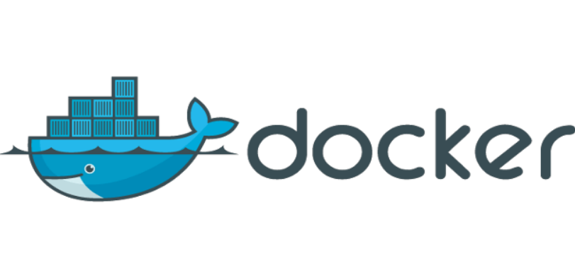

## docker入门

### 1. docker是什么？

**Docker 属于 Linux 容器的一种封装，提供简单易用的容器使用接口。**它是目前最流行的 Linux 容器解决方案。

Docker 将应用程序与该程序的依赖，打包在一个文件里面。运行这个文件，就会生成一个虚拟容器。程序在这个虚拟容器里运行，就好像在真实的物理机上运行一样。有了 Docker，就不用担心环境问题。

总体来说，Docker 的接口相当简单，用户可以方便地创建和使用容器，把自己的应用放入容器。容器还可以进行版本管理、复制、分享、修改，就像管理普通的代码一样。



### 2. docker的用途

Docker 的主要用途，目前有三大类。

**（1）提供一次性的环境。**比如，本地测试他人的软件、持续集成的时候提供单元测试和构建的环境。

**（2）提供弹性的云服务。**因为 Docker 容器可以随开随关，很适合动态扩容和缩容。

**（3）组建微服务架构。**通过多个容器，一台机器可以跑多个服务，因此在本机就可以模拟出微服务架构。


**腾讯云服务器默认安装了docker，所以不用去装docker。**


### 3.docker的启动

**将当前用户添加到 docker 用户组**

Docker 需要用户具有 sudo 权限，为了避免每次命令都输入`sudo`，可以把用户加入 Docker 用户组。

```
sudo usermod -aG docker $USER
```

**启动docker服务**

```
service docker start
```

### 4. image文件

image 文件可以看作是容器的模板。Docker 根据 image 文件生成容器的实例。同一个 image 文件，可以生成多个同时运行的容器实例。可以在 Docker 中央仓库中查找想要的镜像 https://hub.docker.com/

```
# 列出本机的所有 image 文件。
docker image ls

# 删除 image 文件 imageName可以是IMAGE ID，也可以是name
docker image rm [imageName]

#　从拉取一个镜像
docker pull ubuntu:20.04
```

### 5. 容器文件

 **image 文件生成的容器实例，本身也是一个文件，称为容器文件。**也就是说，一旦容器生成，就会同时存在两个文件： image 文件和容器文件。而且关闭容器并不会删除容器文件，只是容器停止运行而已。一个镜像可以创建多个容器。

```
# 利用镜像 ubuntu:20.04 创建一个容器
docker create -it ubuntu:20.04 

# 列出本机所有容器，不包括终止运行的容器
docker container ls

# 列出本机所有容器，包括终止运行的容器
docker container ls --all

# 启动指定的容器 CONTAINER可以是容器的name，也可以是容器的id
docker start CONTAINER

# 停止指定的容器 CONTAINER可以是容器的name，也可以是容器的id
docker stop CONTAINER

# 重启指定的容器 CONTAINER可以是容器的name，也可以是容器的id
docker restart CONTAINER

# 进入指定的容器 CONTAINER可以是容器的name，也可以是容器的id
docker attach CONTAINER

# 在容器中执行命令
进入指定的容器后，然后使用linux命令

# 退出后不关闭容器（挂起容器）
ctrl+p+ctrl+q
```

**可以把 docker 容器看成一个全新的 Linux 服务器。ls 查看根目录就是 linux 文件目录。**

```
# 删除指定的容器 CONTAINER可以是容器的name，也可以是容器的id
docker rm CONTAINER

# 查看某个容器内的所有进程 CONTAINER可以是容器的name，也可以是容器的id
docker top CONTAINER

# 查看所有容器的统计信息，CPU、内存、存储、网络等信息 ctrl+c为退出
docker stats

# 重命名容器
docker rename CONTAINER1 CONTAINER2
```
