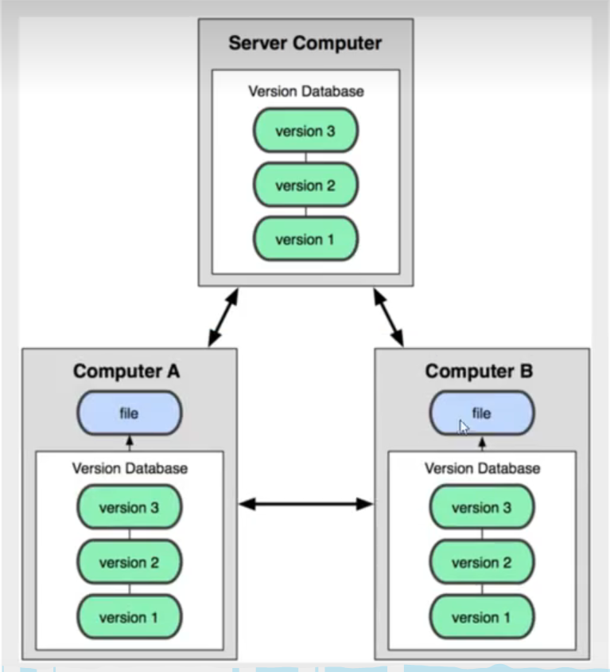
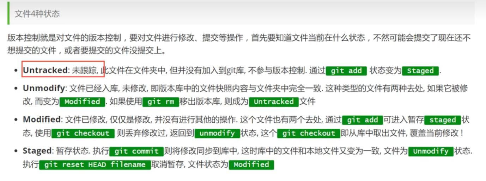
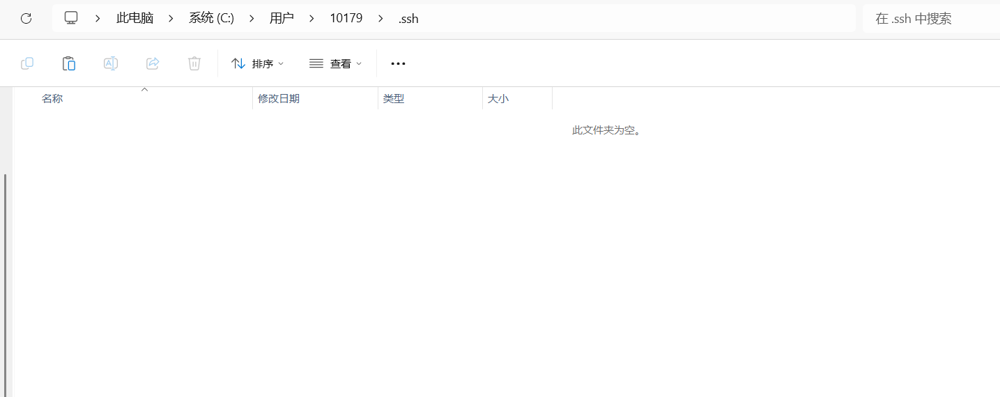
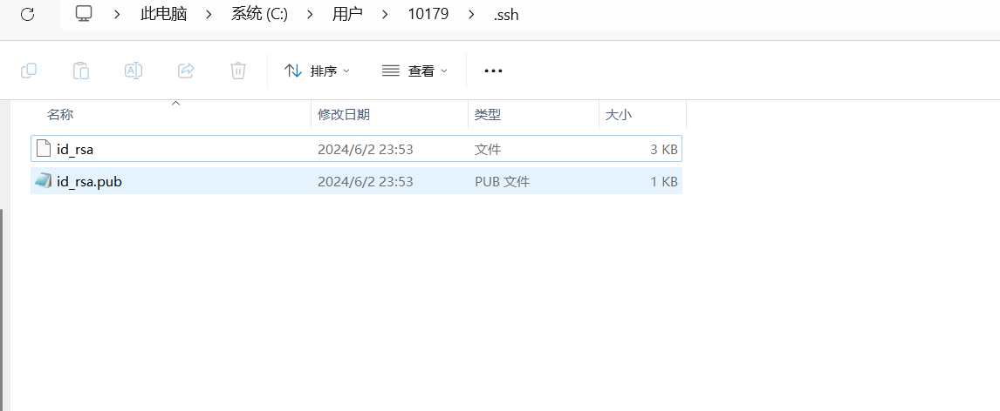
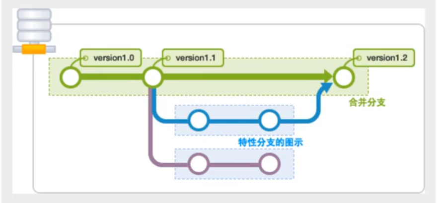

### 分布式版本控制

每个人都知道项目的代码，并且可以推进项目的进行。




### git命令分类整理

#### 全局设置

git config --global user.name xxx：设置全局用户名，信息记录在~/.gitconfig文件中
git config --global user.email xxx@xxx.com：设置全局邮箱地址，信息记录在~/.gitconfig文件中
git init：将当前目录配置成git仓库，信息记录在隐藏的.git文件夹中
#### 常用命令

git add XX ：将XX文件添加到暂存区
git commit -m "给自己看的备注信息"：将暂存区的内容提交到当前分支
git status：查看仓库状态
git log：查看当前分支的所有版本
git push -u (第一次需要-u以后不需要) ：将当前分支推送到远程仓库
git clone git@git.acwing.com:xxx/XXX.git：将远程仓库XXX下载到当前目录下
git branch：查看所有分支和当前所处分支
#### 查看命令

git diff XX：查看XX文件相对于暂存区修改了哪些内容
git status：查看仓库状态
git log：查看当前分支的所有版本
git log --pretty=oneline：用一行来显示
git reflog：查看HEAD指针的移动历史（包括被回滚的版本）
git branch：查看所有分支和当前所处分支
git pull ：将远程仓库的当前分支与本地仓库的当前分支合并

#### 删除命令

git rm --cached XX：将文件从仓库索引目录中删掉，不希望管理这个文件
git restore --staged xx：==将xx从暂存区里移除==
git checkout — XX或git restore XX：==将XX文件尚未加入暂存区的修改全部撤销==
#### 代码回滚

git reset --hard HEAD^ 或git reset --hard HEAD~ ：将代码库回滚到上一个版本
git reset --hard HEAD^^：往上回滚两次，以此类推
git reset --hard HEAD~100：往上回滚100个版本
git reset --hard 版本号：回滚到某一特定版本
#### 远程仓库

git remote add origin git@git.acwing.com:xxx/XXX.git：将本地仓库关联到远程仓库
git remote remove origin 取消关联远程origin仓库
git push -u (第一次需要-u以后不需要) ：将当前分支推送到远程仓库
git push origin branch_name：将本地的某个分支推送到远程仓库
git clone git@git.acwing.com:xxx/XXX.git：将远程仓库XXX下载到当前目录下
git push --set-upstream origin branch_name：设置本地的branch_name分支对应远程仓库的branch_name分支
git push -d origin branch_name：删除远程仓库的branch_name分支
git checkout -t origin/branch_name 将远程的branch_name分支拉取到本地
git pull ：将远程仓库的当前分支与本地仓库的当前分支合并
git pull origin branch_name：将远程仓库的branch_name分支与本地仓库的当前分支合并
git branch --set-upstream-to=origin/branch_name1 branch_name2：将远程的branch_name1分支与本地的branch_name2分支对应

#### 分支命令

git branch branch_name：创建新分支，但是依然停留当前分支
git branch：查看所有分支和当前所处分支
git switch branch_name：切换到branch_name这个分支
git merge branch_name：将分支branch_name合并到当前分支上
git branch -d branch_name：删除本地仓库的branch_name分支
git push --set-upstream origin branch_name：设置本地的branch_name分支对应远程仓库的branch_name分支
git push -d origin branch_name：删除远程仓库的branch_name分支
git checkout -t origin/branch_name 将远程的branch_name分支拉取到本地
git pull ：将远程仓库的当前分支与本地仓库的当前分支合并
git pull origin branch_name：将远程仓库的branch_name分支与本地仓库的当前分支合并
git branch --set-upstream-to=origin/branch_name1 branch_name2：将远程的branch_name1分支与本地的branch_name2分支对应

#### stash暂存

git stash：将工作区和暂存区中尚未提交的修改存入栈中
git stash apply：将栈顶存储的修改恢复到当前分支，但不删除栈顶元素
git stash drop：删除栈顶存储的修改
git stash pop：将栈顶存储的修改恢复到当前分支，同时删除栈顶元素
git stash list：查看栈中所有元素


### git的核心原理


### 文件的四种状态




### 配置ssh公钥(推送到远程仓库时实现免密登录)

#### 1. 进入.ssh目录 



#### 2. 生成公钥

 ```
  ssh-keygen -t rsa
 
 ```



#### 3. 将公钥信息public_key添加到github账户中


### git分支



#### git合并冲突(手动解决冲突)

冲突：如果两个分支在同一个时刻，且两个分支同时修改了同一个文件的同一行，在合并时会引起冲突
如何解决冲突？（拿master和new分支举例）
    1.先在某个分支（例如master）中打开这个文件，把内容修改为最终需要的内容
    2.git add 文件名（这里的add并不是从工作区到暂存区，而是告诉git冲突已经解决）
    3.git commit -m "文件注释"
