## 1. 线性模型

**机器学习的工作流程**

首先收集数据集，然后训练模型，然后预测和推理。


**监督学习**

监督学习是一种机器学习方法，它通过分析带有已知输出的示例数据集来训练模型，以便能够预测或决定未见过数据的输出。


**过拟合**：模型在训练集上表现很好，但在测试集中表现较差，即泛化能力差。


通常会把训练集分成，训练集和开发集，开发集通常用于模型性能的评估。


**模型设计**：

要解决的问题：**对数据而言，什么样的模型是最合适的？？？**即f ( x )的形式是什么？？？
最基本的模型是线性模型。

线性模型中，训练时关键的就是确定w和b的值。w被称为权重，b称为偏置。

**对模型做一个简化，去掉截距b。*y*^表示预测结果。**


权重可能大可能小，不一定正好落在真实值，因此需要进行评估。

**评估模型（loss）**


**如何找到合适的权重值，使得损失最小 ？？？**

损失函数（Loss function）是针对一个样本的，对于整个训练集需要将每个样本的预测值和真实值求差然后计算均方根误差。


**然后将均方差以图表的形式呈现**


可以得出w=2的均方差是最小的。

**实践代码**

```python
import numpy as np
import matplotlib.pyplot as plt

# 训练集
x_data = [1.0, 2.0, 3.0]
y_data = [2.0, 4.0, 6.0]


def virtual(w_r, x):
    return w_r * x


def loss(y_r, y):
    return (y_r - y) * (y_r - y)


# w_list存储每个权重值，mse_list存储每个权重值对应的损失值
w_list = []
mse_list = []

for w in np.arange(0.0, 4.1, 0.1):

    print(f"w = {w}")
    loss_sum = 0

    for x_real, y_real in zip(x_data, y_data):
        # zip(numbers, letters)创建一个生成 (x, y) 形式的元组的迭代器，[(numbers[0], letters[0]),…,(numbers[n], letters[n])]
        y_virtual = virtual(w, x_real)
        loss_val = loss(y_real, y_virtual)

        loss_sum += loss_val  # 叠加每个样本的损失值
        print(x_real, y_real, y_virtual, loss_val)

    print(loss_sum / 3)
    w_list.append(w)
    mse_list.append(loss_sum / 3)
    print()

# 画图 x轴是权重w，y轴是loss值，即表示每个权重值w对应的loss值
import matplotlib.pyplot as plt
plt.plot(w_list, mse_list)
plt.ylabel("loss")
plt.xlabel("w")
plt.show()
```


**运行结果**


补充：在深度学习中做训练的时候，loss曲线中一般不是用权重来做横坐标，而是训练轮数（epoch）


## 2. 梯度下降算法

**梯度下降法**：

有一个初始猜测值，但需要确定搜索方向？


**采用梯度确定搜索方向**

对代价函数cost求关于权重w的导数，可以类似于有正负值的加速度。可以得到cost的最小值。

- *α*是学习率，即搜索步长


**迭代公式**


**梯度下降法只能保证找到局部最优点，不一定能找到全局最优**


**鞍点：梯度等于0**（马鞍面）


**相关公式**


**相关代码**

```python
import numpy as np
import matplotlib.pyplot as plt

# 训练集
x_data = [1.0, 2.0, 3.0]
y_data = [2.0, 4.0, 6.0]

# 初始权重的猜测值
w = 1.0

# 存储训练轮数以及对应的loss值用于绘图
epoch_list = []
cost_list = []


def forward(x):
    return x * w

# 计算损失均方差
def cost(xs, ys):
    # 定义代价函数cost(w)。xs就是x_data, ys就是y_data
    cost = 0
    for x, y in zip(xs, ys):
        y_pred = forward(x)  # y_hat
        cost += (y_pred - y) ** 2  # (y_hat - y)^2，然后再累加
    return cost / len(xs)  # 累加后再除样本数量N，即MSE公式中的1/N


# 计算梯度，即对cost(w)求关于w的偏导
def gradient(xs, ys):
    grad = 0
    for x, y in zip(xs, ys):
        grad += 2 * x * (x * w - y)  # 累加部分
    return grad / len(xs)  # 除样本数量N


print('Predict (before training)', 4, forward(4))

# 训练过程，迭代100次（100轮训练）
# 每次都是将权重w减去学习率乘以梯度 w=w-a*k
for epoch in np.arange(1, 101, 1):
    cost_val = cost(x_data, y_data)  # 当前步的损失均方差
    grad_val = gradient(x_data, y_data)  # 当前的梯度
    w -= 0.01 * grad_val  # 更新权重w，0.01是学习率
    print('Epoch: ', epoch, 'w = ', w, 'loss = ', cost_val)  # 打印每一轮训练的日志

    # epoch是当前步数 cost_val是当前步均方差
    epoch_list.append(epoch)
    cost_list.append(cost_val)

print('Predict (after training)', 4, forward(4))

# loss曲线绘制，x轴是epoch，y轴是loss值
plt.plot(epoch_list, cost_list)
plt.ylabel('cost')
plt.xlabel('epoch')
plt.show()
```

**训练结果**

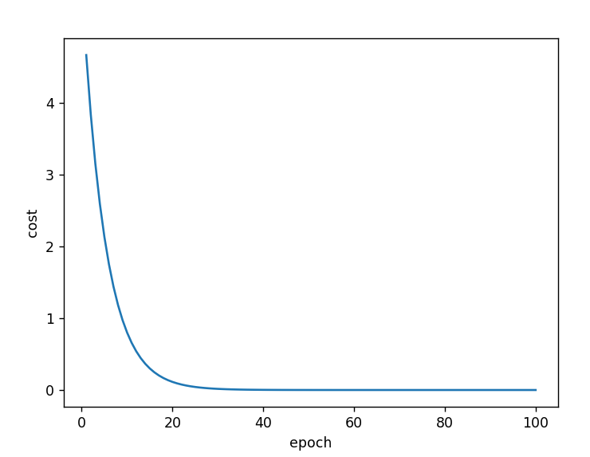

**梯度下降法在实际中应用较少，用的比较多的是它的衍生版本，随机梯度下降**

**随机梯度下降算法**

- 梯度下降法中是对数据集的损失cost进行梯度更新。（对损失总体）
- 提供N个数据，随机梯度下降是从这N个数据中**随机选一个**，将其损失loss来更新，即单个样本的损失对权重求导。（对损失个体）

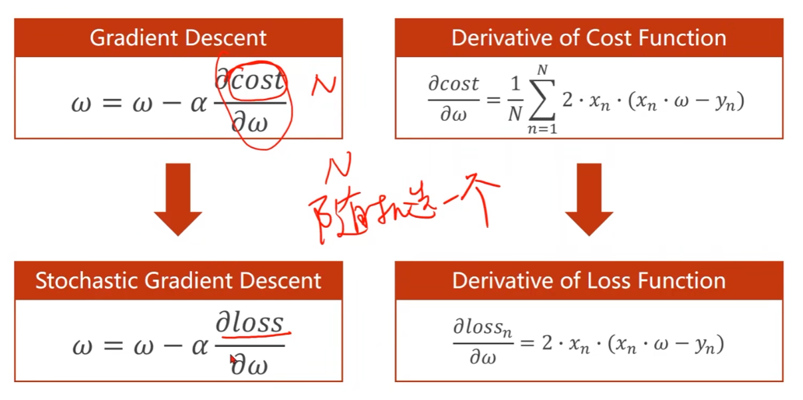

使用随机梯度下降的原因：

曲线存在鞍点。每次随机取1个样本，会引入了随机噪声，那么即便陷入鞍点，随机噪声可能会对其进行推动，那么有可能离开鞍点。


**相关代码**

```python
import matplotlib.pyplot as plt
import numpy as np

# 训练集
x_data = [1.0, 2.0, 3.0]
y_data = [2.0, 4.0, 6.0]

# 初始权重的猜测值
w = 1.0

# 存储训练轮数以及对应的los值用于绘图
epoch_list = []
cost_list = []


# 用x计算y值
def forward(x):
    # 定义模型：y_hat = x * w
    return x * w


# 　损失方差　
def loss(x, y):
    # 计算loss function
    y_pred = forward(x)  # y_hat
    return (y_pred - y) ** 2  # (y_hat - y)^2


# 计算梯度(类似加速度)
def gradient(x, y):
    return 2 * x * (x * w - y)


# 训练前假设一个最理想的情况
print('Predict (before training)', 4, forward(4))

# 训练过程
for epoch in np.arange(1, 101, 1):
    for x, y in zip(x_data, y_data):
        grad = gradient(x, y)  # 对每一个样本求梯度
        w = w - 0.01 * grad  # 用一个样本的梯度来更新权重，而不是所有的
        print("grad: ", x, y, grad)
        l = loss(x, y)

    print("progress:", epoch, "w = ", w, "loss = ", l)
    print()

    epoch_list.append(epoch)
    cost_list.append(l)
print('Predict (after training)', 4, forward(4))

# loss曲线绘制，x轴是epoch，y轴是loss值
plt.plot(epoch_list, cost_list)
plt.ylabel('cost')
plt.xlabel('epoch')
plt.show()
```

**训练结果**


- 梯度下降法可以并行计算，时间复杂度低，但学习器的性能差
- 随机梯度下降无法并行计算，时间复杂度高，但学习器的性能好

**总结：梯度下降算法到了鞍点就截止了，只是求到了局部最优解。随机梯度下降算法就是给了一大堆随机的数据，得到一大堆的局部最优解，从而得到全局最优解。**


## 3. 反向传播算法

**神经网络计算图的画法**

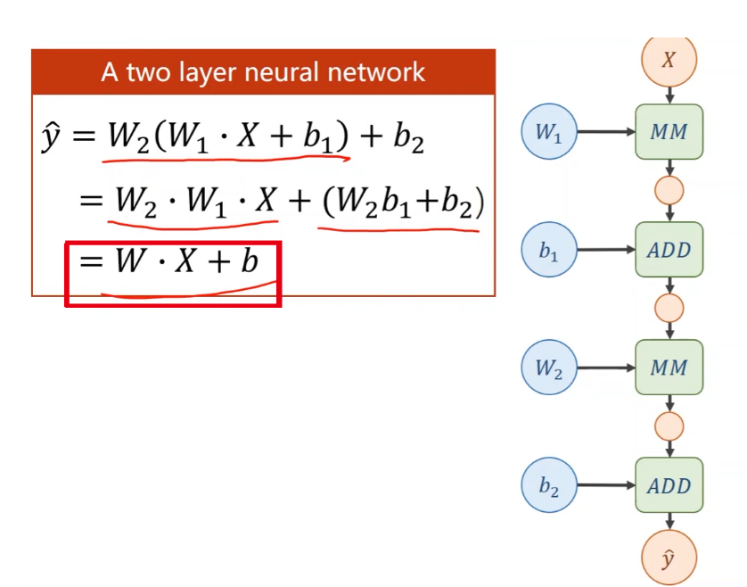

**链式法则**

步骤：

1. 前馈计算（用于创建计算图）

​			**从输入x沿着向最终的loss计算，计算出每一个变量的值。**

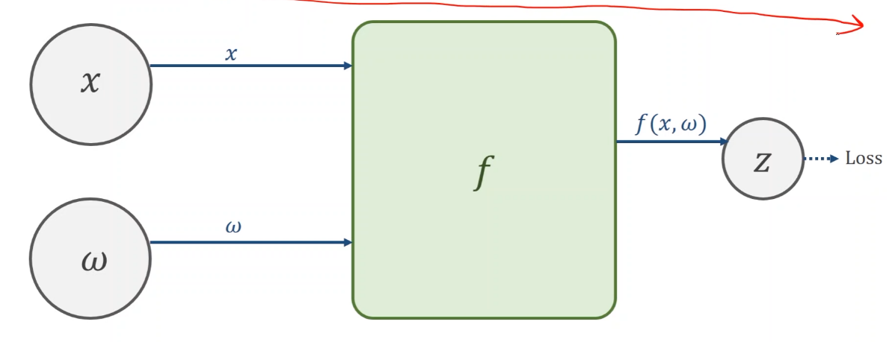


2. 局部梯度

​			**z=f(x,w)**

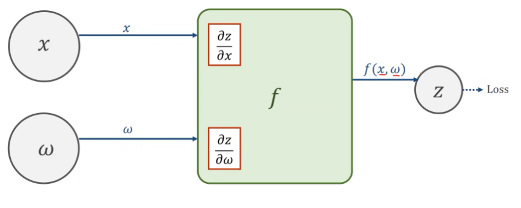

3. 拿到l对z的偏导(直接给的)


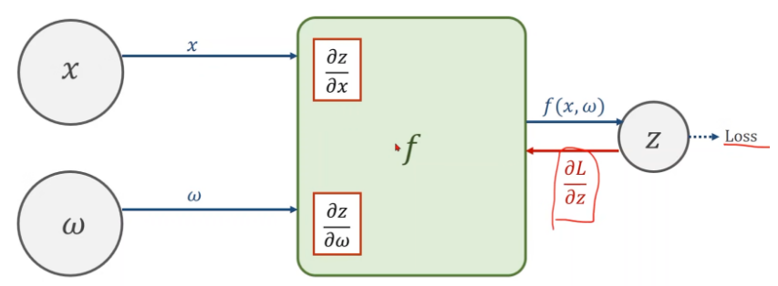

4. 反馈计算

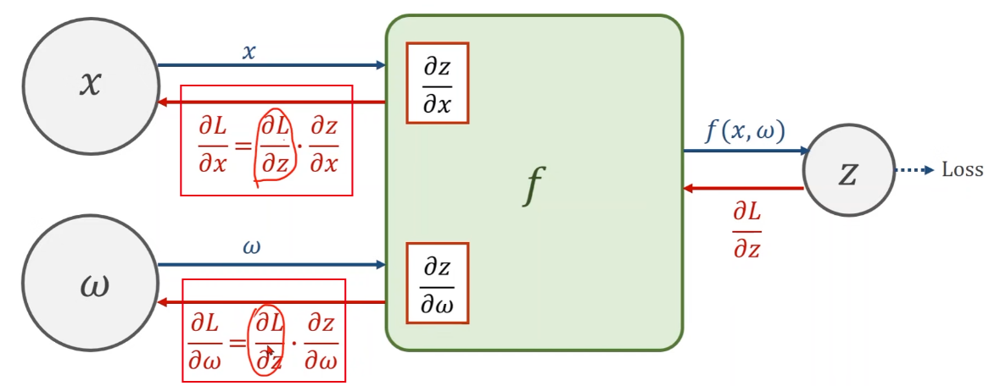


**PyTorch中如何实现前馈和反馈计算？**

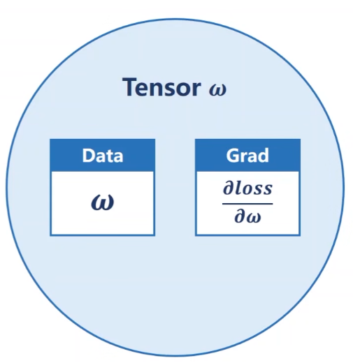

**训练代码**

```python
import torch  # 导入pytorch库
import matplotlib.pyplot as plt

# 训练集
x_data = [1.0, 2.0, 3.0]
y_data = [2.0, 4.0, 6.0]

# 结果集
epoch_list = []
cost_list = []

# 权重
w = torch.Tensor([1.0])  # 使用pytorch中的Tensor进行定义赋值
w.requires_grad = True  # 表示需要计算梯度，默认的是False，即不计算梯度


def forward(x):
    # 定义模型：y_hat = x * w，其中w是一个张量Tensor，因此该乘法*被重载了，变成了Tensor之间的数乘
    # x需要为Tensor，如果不是，则会自动转换成Tensor
    return x * w


# 损失均方差
def loss(x, y):
    y_pred = forward(x)
    return (y_pred - y) ** 2


print('Predict (before training)', 4, forward(4).item())

for epoch in range(100):
    for x, y in zip(x_data, y_data):
        l = loss(x, y)  # 前馈计算，创建出计算图.l是tensor类型
        l.backward()  # 反馈,计算出l对w的偏导，并且存储在w中
        print("grad: ", x, y, w.grad.item())  # item是将梯度中的数值取出来作为一个标量

        w.data = w.data - 0.01 * w.grad.data

        w.grad.data.zero_()  # 更新完成后将梯度清零，否则会被累加到下一轮训练

    print("progress: ", epoch, l.item())
    epoch_list.append(epoch)
    cost_list.append(l.item())

print('Predict (after training)', 4, forward(4).item())

plt.plot(epoch_list, cost_list)
plt.ylabel('cost')
plt.xlabel('epoch')
plt.show()
```

**相关结果**

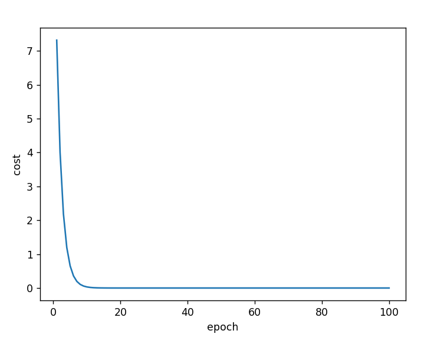


**补充相关计算图**

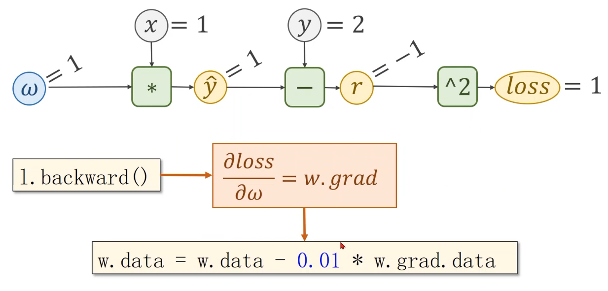


## 4. 使用pytorch实现线性回归

**1. 准备数据集**

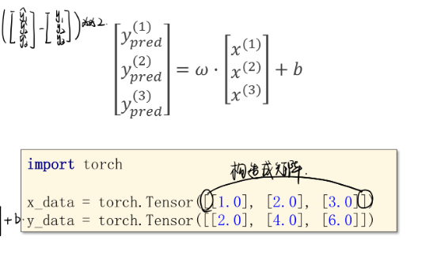

**2. 设计模型**

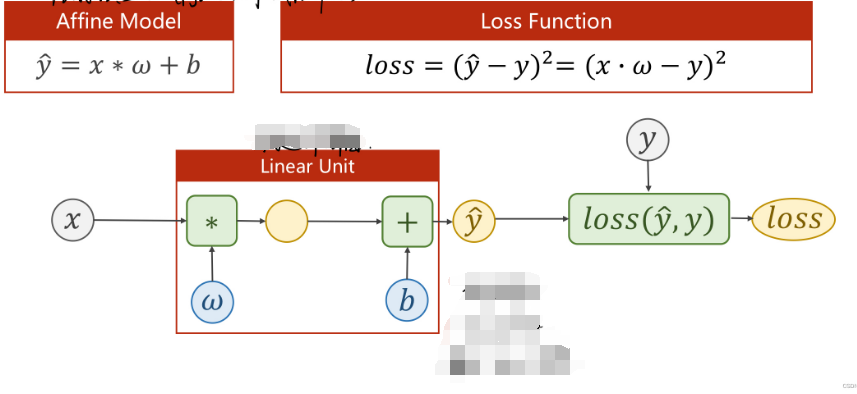

**3. 构造损失函数和优化器**

1. 损失函数使用MSE
   - MSELoss继承自nn.Module，参与计算图的构建

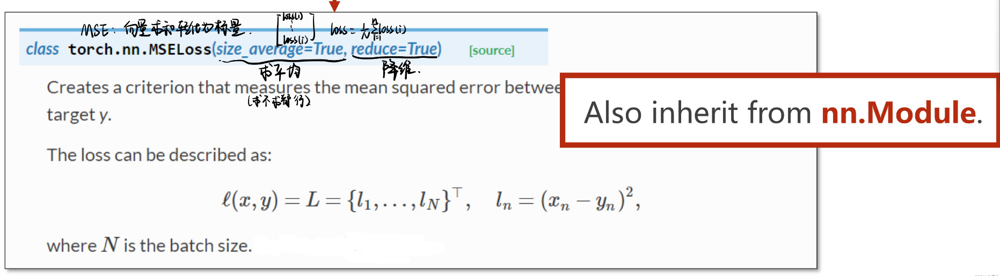

- size_average：是否要求均值（可求可不求）
- reduce：是否要降维（一般只考虑size_average）

2. 优化器使用SGD
   * torch.optim.SGD()是一个类，与nn.Module无关，不参与计算图的构建

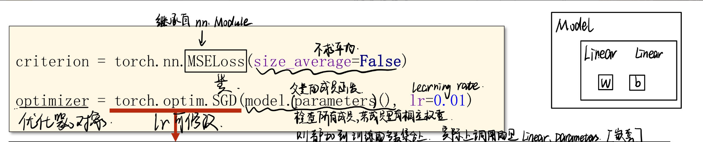

model中并没有定义相应的权重，但里面的成员函数linear有权重。model.parameters()是继承自Module，它会检查model中的所有成员函数，如果成员中有相应的权重，那就将其都加到最终的训练结果上。lr：learning rate，一般都设定一个固定的学习率。


**4. 训练过程**

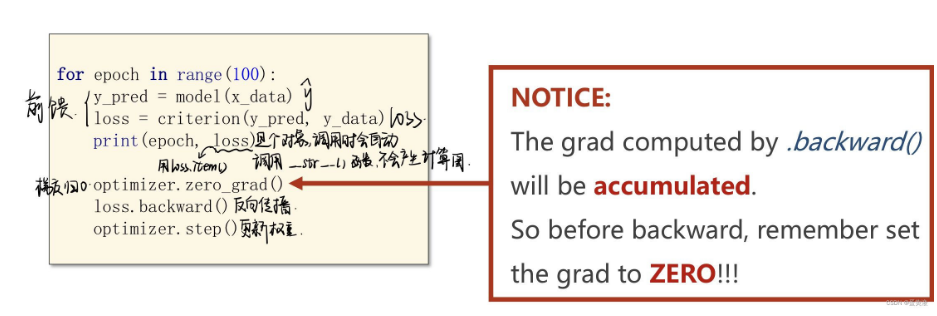

**5. 代码实现**

```python
import torch

x_data = torch.Tensor([[1.0], [2.0], [3.0]])
y_data = torch.Tensor([[2.0], [4.0], [6.0]])

epoch_list = []
cost_list = []

# 设计线性回归模型
class LinearModel(torch.nn.Module):  # 从module继承类
    def __init__(self):
        # super调用父类构造
        super().__init__()
        self.linear = torch.nn.Linear(1, 1)  # （1,1）输入的x是一维向量，输出y也是一维向量

    def forward(self, x):  # 只能写forward，forward的本意是前馈，但是这里并没有进行前馈计算，只是构建了计算图。
        y_pred = self.linear(x)  # 实现一个可调用的对象，也就是线性模型,同时也创建了计算图
        return y_pred


# w和b是初始化随机值的
model = LinearModel()

# 构造损失函数和优化函数
criterion = torch.nn.MSELoss(reduction='sum')  # sum表示方差要计算总和、mse表示的是计算平均值。
# sgd表示用随机梯度下降算法来优化。model.parameters()表示的是model中的所有参数。weight and bias
optimizer = torch.optim.SGD(model.parameters(), lr=0.01)


for epoch in range(100):  # 迭代100次
    y_pred = model(x_data)  # 在创建实例对象的中途，同时调用了forward方法。


    loss = criterion(y_pred, y_data)  # 前馈
    epoch_list.append(epoch)
    cost_list.append(loss.item())
    print(epoch, loss.item())
    print('w=', model.linear.weight.item())
    print('b=', model.linear.bias.item())
    print()

    optimizer.zero_grad()  # 梯度归零
    loss.backward()  # 反向传播
    optimizer.step()  # 更新


x_test = torch.Tensor([[4.0]])
y_test = model(x_test)
print('y_pred=', y_test.item())

print(epoch_list)
print(cost_list)
```


**6. 训练结果**


## 5. 逻辑回归函数

逻辑回归本质是线性回归，但是它加了sigmoid函数。换句话来说就是01分布。

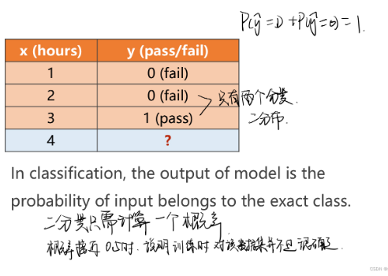

**二分类损失函数**


**Mini-Batch**


**逻辑斯蒂函数**

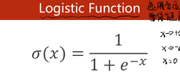

**逻辑回归计算图**

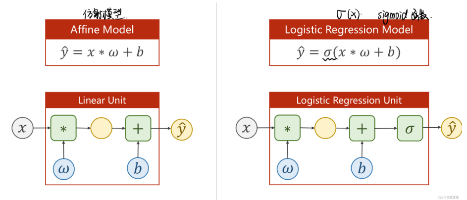


**训练代码**

```python
import torch
import torch.nn.functional as F
import numpy as np
import matplotlib.pyplot as plt

# 数据集
x_data = torch.Tensor([[1.0], [2.0], [3.0]])
y_data = torch.Tensor([[0], [0], [1]])


# 　设计逻辑回归模型
class LogisticRegressionModel(torch.nn.Module):
    def __init__(self):
        super().__init__()
        self.linear = torch.nn.Linear(1, 1)  # 输入的向量是一维向量，输出的向量是一维向量

    def forward(self, x):
        #  linear(): argument 'input' (position 1) must be Tensor
        y_pred = F.sigmoid(self.linear(x))  # 构建计算图
        return y_pred


# 构建逻辑回归模型
model = LogisticRegressionModel()
# 构建损失函数和优化器
criterion = torch.nn.BCELoss(reduction='sum')
optimizer = torch.optim.SGD(model.parameters(), lr=0.01)

# 训练过程
for epoch in range(1000):
    y_pred = model(x_data)  # 前馈：计算y_hat
    loss = criterion(y_pred, y_data)  # 前馈：计算损失
    print(epoch, loss.item())
    # 输出权重和偏置
    print('w = ', model.linear.weight.item())
    print('b = ', model.linear.bias.item())

    optimizer.zero_grad()  # 反馈：在反向传播开始将上一轮的梯度归零
    loss.backward()  # 反馈：反向传播（计算梯度）
    optimizer.step()  # 更新权重w和偏置b

# 测试模型
x = np.linspace(0, 10, 200)  # 每周学习时间从0 ~ 10小时采样200个点
x_t = torch.Tensor(x).view((200, 1))  # 将学习时间x转成200行1列的张量
y_t = model(x_t)  # 输给模型
y = y_t.data.numpy()  # 将y_t的数据拿出来

plt.plot(x, y)
plt.plot([0, 10], [0.5, 0.5])
plt.xlabel('Hours')
plt.ylabel('Probability of Pass')
plt.grid()
plt.show()
```


**训练结果**

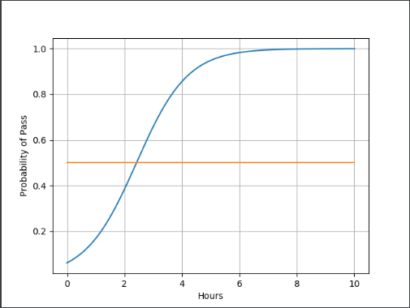

