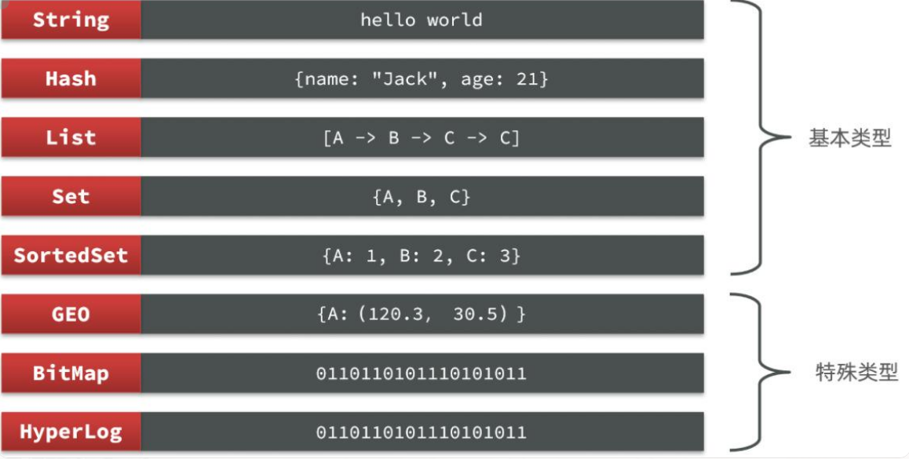
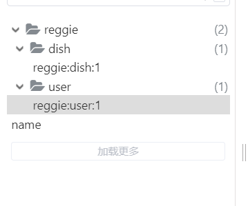
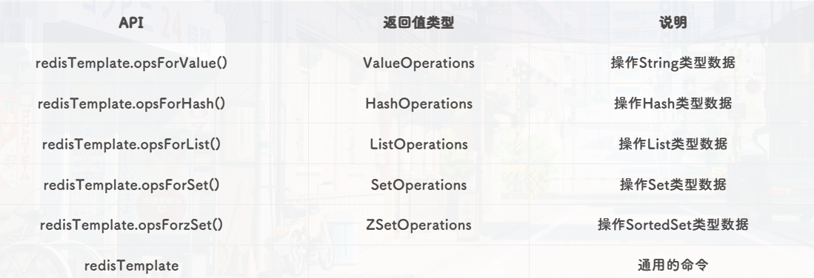

## redis基础

### 1. 初识redis

Redis是一种键值型的NoSQL数据库。键值型是指Redis中存储的数据都是以Key-Value键值对的形式存储，而Value的形式多种多样，可以使字符串、数值甚至Json。NoSQL数据库是非关系型数据库。

特点：redis操作更多的是依赖于内存来操作，内存的读写速度会非常快，性能自然会好一些。redis有持久化功能，会把内存中的数据持久化到磁盘中。

**redis最常见命令行**

```
# 启动redis服务 
redis-server

# 进入redis客户端
redis-cli
```


### 2. redis命令行操作

redis一共有8种数据结构类型，常见的数据结构类型就基本类型那5种。



**1. String类型**

```
1. 存储： set key value
       127.0.0.1:6379> set username zhangsan
       OK

2. 获取： get key
   127.0.0.1:6379> get username
   "zhangsan"

3. 删除： del key
   127.0.0.1:6379> del age
   (integer) 1
```

**如果项目中的id发生冲突，即user表的id=1和product表的id=1发生冲突，则key可以采用以下格式**

```
项目名:业务名:类型:id
```

**举个例子**

```
127.0.0.1:6379> set reggie:user:1 '{id:1,name: Jack, age: 21}'
OK
127.0.0.1:6379> set reggie:dish:1 '{id:1,name: Jack, age: 21}'
OK
```

**可视化结果**



**2. hash类型**

```
1. 存储： 
		hset key field value
        127.0.0.1:6379> hset myhash username lisi
        (integer) 1
        127.0.0.1:6379> hset myhash password 123
        (integer) 1
2. 获取： 
        hget key field: 获取指定的field对应的值
            127.0.0.1:6379> hget myhash username
            "lisi"
        hgetall key：获取所有的field和value
            127.0.0.1:6379> hgetall myhash
            1) "username"
            2) "lisi"
            3) "password"
            4) "123"
3. 删除： 
		hdel key field
        127.0.0.1:6379> hdel myhash username
        (integer) 1
```

**3. list类型**(和队列有点像)

```
1. 添加：
        1. lpush key value: 将元素加入列表左表

        2. rpush key value：将元素加入列表右边

            127.0.0.1:6379> lpush myList a
            (integer) 1
            127.0.0.1:6379> lpush myList b
            (integer) 2
            127.0.0.1:6379> rpush myList c
            (integer) 3
2. 获取：
        * lrange key start end ：范围获取
            127.0.0.1:6379> lrange myList 0 -1
            1) "b"
            2) "a"
            3) "c"
3. 删除：
        * lpop key：删除列表最左边的元素，并将元素返回
        * rpop key：删除列表最右边的元素，并将元素返回
```

**4. set类型**(不允许重复元素)

```
1. 存储：sadd key value
        127.0.0.1:6379> sadd myset a
        (integer) 1
        127.0.0.1:6379> sadd myset a
        (integer) 0
2. 获取：smembers key:获取set集合中所有元素
        127.0.0.1:6379> smembers myset
        1) "a"
3. 删除：srem key value:删除set集合中的某个元素  
        127.0.0.1:6379> srem myset a
        (integer) 1

```

**5. sortedSet类型**(经常用于排行榜，根据分数从大到小排序    key score value)

```
 1. 存储：zadd key score value
        127.0.0.1:6379> zadd mysort 60 zhangsan
        (integer) 1
        127.0.0.1:6379> zadd mysort 50 lisi
        (integer) 1
        127.0.0.1:6379> zadd mysort 80 wangwu
        (integer) 1
        
 2. 获取：zrange key start end [withscores]
        127.0.0.1:6379> zrange mysort 0 -1
        1) "lisi"
        2) "zhangsan"
        3) "wangwu"

3. 删除：zrem key value
        127.0.0.1:6379> zrem mysort lisi
        (integer) 1
```


### 3. SpringDataRedis客户端

Jedis和Lettuce：这两个主要是提供了Redis命令对应的API，方便我们操作Redis，而SpringDataRedis又对这两种做了抽象和封装，因此我们后期会直接以SpringDataRedis来学习。


SpringDataRedis中提供了RedisTemplate工具类，其中封装了各种对Redis的操作。并且将不同数据类型的操作API封装到了不同的类型中：




**快速入门**

SpringBoot已经提供了对SpringDataRedis的支持，使用起来非常简单。

1. 导入依赖

   ```xml
   <!--redis依赖-->
   <dependency>
       <groupId>org.springframework.boot</groupId>
       <artifactId>spring-boot-starter-data-redis</artifactId>
   </dependency>
   <!--common-pool-->
   <dependency>
       <groupId>org.apache.commons</groupId>
       <artifactId>commons-pool2</artifactId>
   </dependency>
   <!--Jackson依赖-->
   <dependency>
       <groupId>com.fasterxml.jackson.core</groupId>
       <artifactId>jackson-databind</artifactId>
   </dependency>
   <!--lombok-->
   <dependency>
       <groupId>org.projectlombok</groupId>
       <artifactId>lombok</artifactId>
       <optional>true</optional>
   </dependency>
   <dependency>
       <groupId>org.springframework.boot</groupId>
       <artifactId>spring-boot-starter-test</artifactId>
       <scope>test</scope>
   </dependency>
   ```

2. 配置redis(application.yaml文件)

   ```
   spring:
     redis:
       host: 127.0.0.1
       port: 6379
       lettuce:
         pool:
           max-active: 8
           max-idle: 8
           min-idle: 0
           max-wait: 100ms

3. 编写测试方法

   ```
   package com.example.demo;
   
   import com.example.pojo.User;
   import com.fasterxml.jackson.core.JsonProcessingException;
   import com.fasterxml.jackson.databind.ObjectMapper;
   import org.junit.jupiter.api.Test;
   import org.springframework.beans.factory.annotation.Autowired;
   import org.springframework.boot.test.context.SpringBootTest;
   import org.springframework.data.redis.core.RedisTemplate;
   import org.springframework.data.redis.core.StringRedisTemplate;
   
   @SpringBootTest
   class Demo1ApplicationTests {
   
       @Autowired
       //系统默认采用的是jdk序列化器，把字对象转化成字节码。但是这里使用的是StringRedisTemplate，把字符串转换成字符串。
       private StringRedisTemplate stringRedisTemplate;
   
       @Test
       void test1() {
           stringRedisTemplate.opsForValue().set("name","虎哥");
           String name = (String) stringRedisTemplate.opsForValue().get("name");
   
           System.out.println("name:"+name);
       }
   
       //序列化工具
       private static final ObjectMapper mapper = new ObjectMapper();
   
       @Test
       void test2() throws JsonProcessingException {
           //创建对象
           User user = new User("张三", 18);
           //手动序列化 对象转化成字符串
           String json = mapper.writeValueAsString(user);
           //写入数据
           stringRedisTemplate.opsForValue().set("name", json);
           //获取数据
           String userdata = stringRedisTemplate.opsForValue().get("name");
           //手动反序列化 字符串转化成对象
           User readValue = mapper.readValue(userdata, User.class);
           System.out.println(readValue);
   
       }
   
   }
   ```

   