## redis基础

### 1. 初识redis

Redis是一种键值型的NoSQL数据库。键值型是指Redis中存储的数据都是以Key-Value键值对的形式存储，而Value的形式多种多样，可以使字符串、数值甚至Json。NoSQL数据库是非关系型数据库。

特点：redis操作更多的是依赖于内存来操作，内存的读写速度会非常快，性能自然会好一些。redis有持久化功能，会把内存中的数据持久化到磁盘中。

**redis最常见命令行**

```
# 启动redis服务 
redis-server

# 进入redis客户端
redis-cli
```


### 2. redis命令行操作

redis一共有8种数据结构类型，常见的数据结构类型就基本类型那5种。


**1. String类型**

```
1. 存储： set key value
       127.0.0.1:6379> set username zhangsan
       OK

2. 获取： get key
   127.0.0.1:6379> get username
   "zhangsan"

3. 删除： del key
   127.0.0.1:6379> del age
   (integer) 1
```

**如果项目中的id发生冲突，即user表的id=1和product表的id=1发生冲突，则key可以采用以下格式**

```
项目名:业务名:类型:id
```

**举个例子**

```
127.0.0.1:6379> set reggie:user:1 '{id:1,name: Jack, age: 21}'
OK
127.0.0.1:6379> set reggie:dish:1 '{id:1,name: Jack, age: 21}'
OK
```

**可视化结果**


**2. hash类型**

```
1. 存储： 
		hset key field value
        127.0.0.1:6379> hset myhash username lisi
        (integer) 1
        127.0.0.1:6379> hset myhash password 123
        (integer) 1
2. 获取： 
        hget key field: 获取指定的field对应的值
            127.0.0.1:6379> hget myhash username
            "lisi"
        hgetall key：获取所有的field和value
            127.0.0.1:6379> hgetall myhash
            1) "username"
            2) "lisi"
            3) "password"
            4) "123"
3. 删除： 
		hdel key field
        127.0.0.1:6379> hdel myhash username
        (integer) 1
```

**3. list类型**(和队列有点像)

```
1. 添加：
        1. lpush key value: 将元素加入列表左表

        2. rpush key value：将元素加入列表右边

            127.0.0.1:6379> lpush myList a
            (integer) 1
            127.0.0.1:6379> lpush myList b
            (integer) 2
            127.0.0.1:6379> rpush myList c
            (integer) 3
2. 获取：
        * lrange key start end ：范围获取
            127.0.0.1:6379> lrange myList 0 -1
            1) "b"
            2) "a"
            3) "c"
3. 删除：
        * lpop key：删除列表最左边的元素，并将元素返回
        * rpop key：删除列表最右边的元素，并将元素返回
```

**4. set类型**(不允许重复元素)

```
1. 存储：sadd key value
        127.0.0.1:6379> sadd myset a
        (integer) 1
        127.0.0.1:6379> sadd myset a
        (integer) 0
2. 获取：smembers key:获取set集合中所有元素
        127.0.0.1:6379> smembers myset
        1) "a"
3. 删除：srem key value:删除set集合中的某个元素  
        127.0.0.1:6379> srem myset a
        (integer) 1

```

**5. sortedSet类型**(经常用于排行榜，根据分数从大到小排序    key score value)

```
 1. 存储：zadd key score value
        127.0.0.1:6379> zadd mysort 60 zhangsan
        (integer) 1
        127.0.0.1:6379> zadd mysort 50 lisi
        (integer) 1
        127.0.0.1:6379> zadd mysort 80 wangwu
        (integer) 1
        
 2. 获取：zrange key start end [withscores]
        127.0.0.1:6379> zrange mysort 0 -1
        1) "lisi"
        2) "zhangsan"
        3) "wangwu"

3. 删除：zrem key value
        127.0.0.1:6379> zrem mysort lisi
        (integer) 1
```


### 3. SpringDataRedis客户端

Jedis和Lettuce：这两个主要是提供了Redis命令对应的API，方便我们操作Redis，而SpringDataRedis又对这两种做了抽象和封装，因此我们后期会直接以SpringDataRedis来学习。


SpringDataRedis中提供了RedisTemplate工具类，其中封装了各种对Redis的操作。并且将不同数据类型的操作API封装到了不同的类型中：


**快速入门**

SpringBoot已经提供了对SpringDataRedis的支持，使用起来非常简单。

1. 导入依赖

   ```xml
   <!--redis依赖-->
   <dependency>
       <groupId>org.springframework.boot</groupId>
       <artifactId>spring-boot-starter-data-redis</artifactId>
   </dependency>
   <!--common-pool-->
   <dependency>
       <groupId>org.apache.commons</groupId>
       <artifactId>commons-pool2</artifactId>
   </dependency>
   <!--Jackson依赖-->
   <dependency>
       <groupId>com.fasterxml.jackson.core</groupId>
       <artifactId>jackson-databind</artifactId>
   </dependency>
   <!--lombok-->
   <dependency>
       <groupId>org.projectlombok</groupId>
       <artifactId>lombok</artifactId>
       <optional>true</optional>
   </dependency>
   <dependency>
       <groupId>org.springframework.boot</groupId>
       <artifactId>spring-boot-starter-test</artifactId>
       <scope>test</scope>
   </dependency>
   ```

2. 配置redis(application.yaml文件)

   ```
   spring:
     redis:
       host: 127.0.0.1
       port: 6379
       lettuce:
         pool:
           max-active: 8
           max-idle: 8
           min-idle: 0
           max-wait: 100ms

3. 编写测试方法

   ```java
   package com.example.demo;
   
   import com.example.pojo.User;
   import com.fasterxml.jackson.core.JsonProcessingException;
   import com.fasterxml.jackson.databind.ObjectMapper;
   import org.junit.jupiter.api.Test;
   import org.springframework.beans.factory.annotation.Autowired;
   import org.springframework.boot.test.context.SpringBootTest;
   import org.springframework.data.redis.core.RedisTemplate;
   import org.springframework.data.redis.core.StringRedisTemplate;
   
   @SpringBootTest
   class Demo1ApplicationTests {
   
       @Autowired
       //系统默认采用的是jdk序列化器，把字对象转化成字节码。但是这里使用的是StringRedisTemplate，把字符串转换成字符串。
       private StringRedisTemplate stringRedisTemplate;
   
       @Test
       void test1() {
           stringRedisTemplate.opsForValue().set("name","虎哥");
           String name = (String) stringRedisTemplate.opsForValue().get("name");
   
           System.out.println("name:"+name);
       }
   
       //序列化工具
       private static final ObjectMapper mapper = new ObjectMapper();
   
       @Test
       void test2() throws JsonProcessingException {
           //创建对象
           User user = new User("张三", 18);
           //手动序列化 对象转化成字符串
           String json = mapper.writeValueAsString(user);
           //写入数据
           stringRedisTemplate.opsForValue().set("name", json);
           //获取数据
           String userdata = stringRedisTemplate.opsForValue().get("name");
           //手动反序列化 字符串转化成对象
           User readValue = mapper.readValue(userdata, User.class);
           System.out.println(readValue);
   
       }
   
   }
   ```


### 4. redis事务

#### 4.1 基本操作

**什么是redis事务**

Redis事务是一个单独的隔离操作，事务中的所有命令都会序列化、按顺序地执行。事务在执行的过程中，不会被其他客户端发送来的命令请求所打断。


**Multi,Exec,discard**

从输入Multi命令开始，输入的命令都会依次进入命令队列中，但不会执行，直到输入Exec后，Redis会将之前的命令队列中的命令依次执行。组队的过程中可以通过discard来放弃组队。

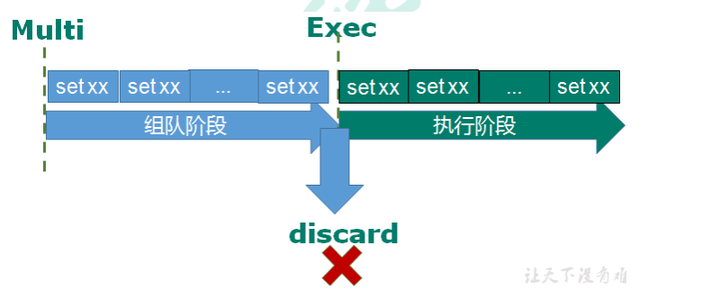

**组队成功，提交成功**

```
127.0.0.1:6379> multi
OK
127.0.0.1:6379> set key1 a
QUEUED
127.0.0.1:6379> set key2 b
QUEUED
127.0.0.1:6379> exec
1) OK
2) OK
```

**事务的错误处理**

1. 组队中某个命令出现了报告错误，执行时整个的所有队列都会被取消。


2. 如果执行阶段某个命令报出了错误，则只有报错的命令不会被执行，而其他的命令都会执行，不会回滚。

#### 4.2事务冲突

**例子**

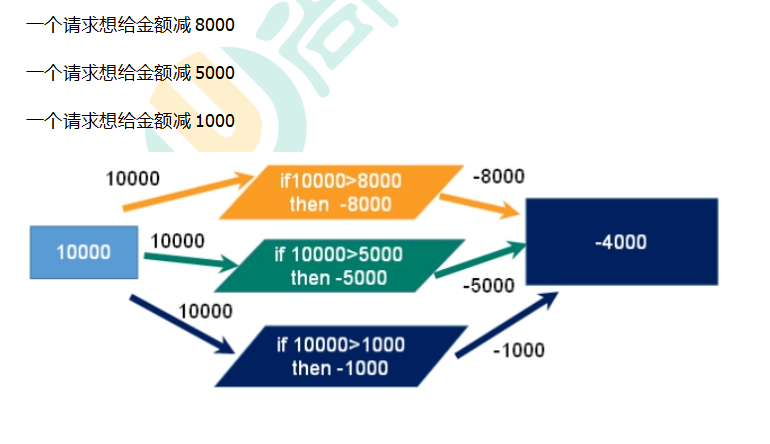

**事务冲突通过悲观锁和乐观锁来解决。**


**悲观锁**

**定义：**悲观锁在操作数据的时候比较悲观，每次去拿数据的时候以为别的线程会修改数据，所以每次拿数据的时候都会上锁。只有等到释放锁的时候才能拿数据。


**乐观锁**

**定义：**乐观锁在操作数据的时候比较乐观，认为别的线程不会同时修改数据，所以不会上锁，但是在更新数据的时候会判断一下别人线程有没有更新这个数据。可以使用版本号等机制。


**watch key1**

在执行multi之前，先执行watch key1 [key2],可以监视一个(或多个) key ，如果在事务执行之前这个(或这些) key 被其他命令所改动，那么事务将被打断。(也就是演示乐观锁)

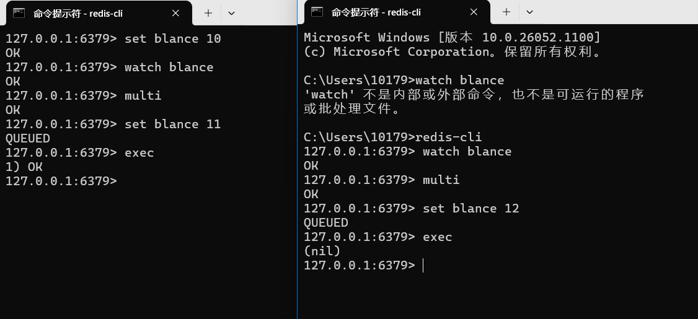


**unwatch**

取消 WATCH 命令对所有 key 的监视。(EXEC 命令或DISCARD 命令先被执行前执行unwatch)

如果在执行 WATCH 命令之后，EXEC 命令或DISCARD 命令先被执行了的话，那么就不需要再执行unwatch了。


**redis事务三特性**

1. 单独的隔离操作

    事务中的所有命令都会序列化、按顺序地执行。事务在执行的过程中，不会被其他客户端发送来的命令请求所打断。 

2. 不保证原子性

   事务中如果有一条命令执行失败，其后的命令仍然会被执行，没有回滚。


	### 5. redis持久化操作


**什么是持久化？**

redis操作硬盘数据，这叫做redis持久化。

redis提供了两种持久化方式：

1. RDB（Redis DataBase Backup file）redis数据备份软件

2. AOF（Append Of File）


#### 5.1 RDB(Redis DataBase Backup file)

**什么是RDB？**

简单地来说就是把内存中所有的数据都记录到磁盘中，同时生成快照文件。当redis故障重启后，从磁盘中读取快照文件，恢复数据。

rdb文件默认保存在当前的运行目录。

退出redis服务之前，会生成一份dump.rdb文件。


redis内部有触发rdb的机制,则可以在redis.window.conf中找到。

```
# 360s内，如果至少有一个key被修改，则执行bgsave
save 360 1
```

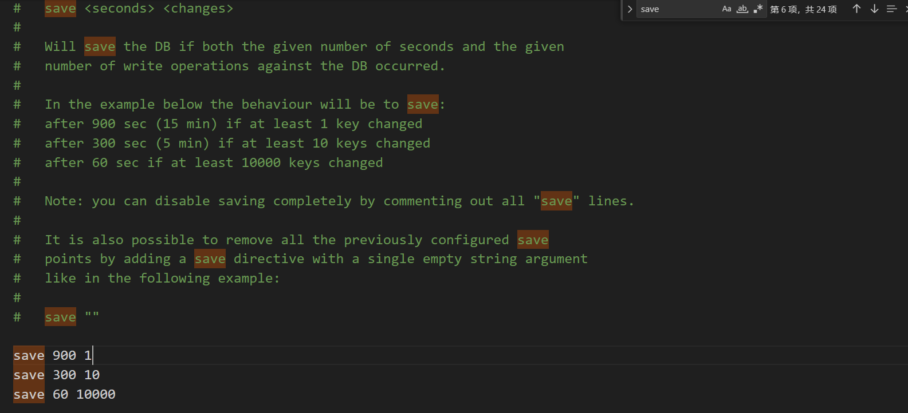

**执行rdb时，数据能被修改吗**

执行bgsave过程中，由于是交给子进程来构建RDB文件,主线程还是可以继续工作的,此时主线程可以修改数据吗？

答：在执行bgsave过程中，redis依然可以继续处理操作命令，也就是数据可以被修改。关键的技术在于写时复制技术。执行bgsave命令的时候，会通过fork()创建子进程，此时子进程和父进程是共享同一片内存数据的，因为创建子进程的时候，会复制父进程的页表，但是页表指向的物理内存还是一个。

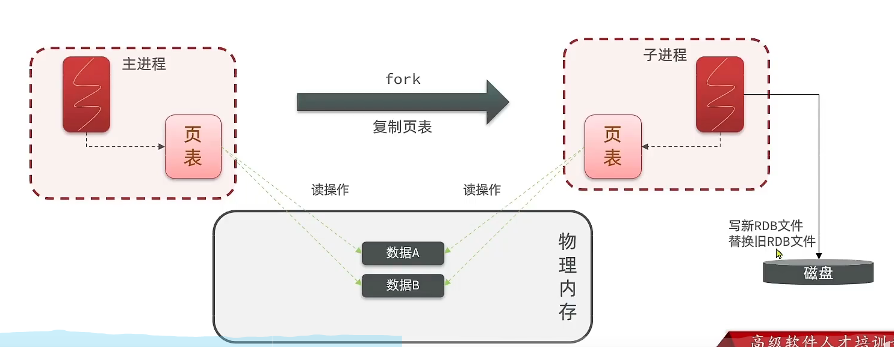

通过主进程中的虚拟内存和物理内存创建一张页表，通过子进程中的虚拟内存和物理内存创建一张页表，。主进程通过页表来读写物理内存中的数据，子进程通过页表来读写内存中的操作数据，最后子进程创建rdb文件并且写入数据，把该文件放到redis.exe所在目录下。


#### 5.2 AOF(Append Only File)

redis处理的每一个写命令都会记录在aof文件中，可以看作成命令日志文件。


aof默认是关闭的，需要修改redis.window.conf配置文件来开启aof。

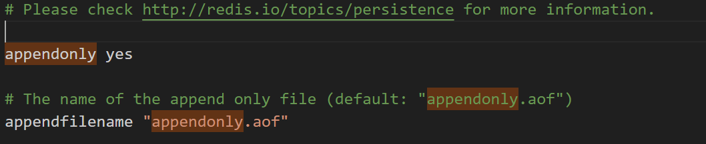

因为是记录命令，aof文件比rdb文件大很多，通过执行bgrewriteaof命令，可以让文件执行重写功能。

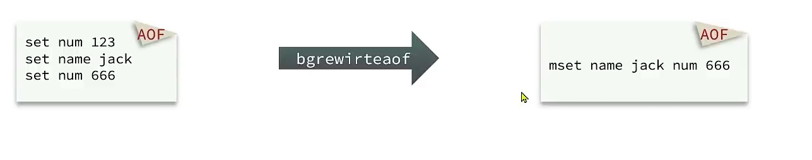

redis也会触发阈值时去重写aof文件，阈值也可以在redis.window.conf文件中配置。

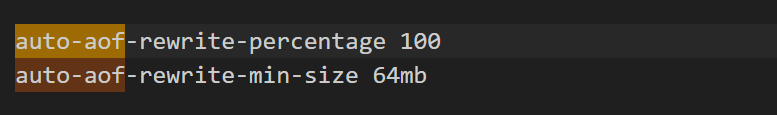


### 6. 主从复制

#### 6.1 简介

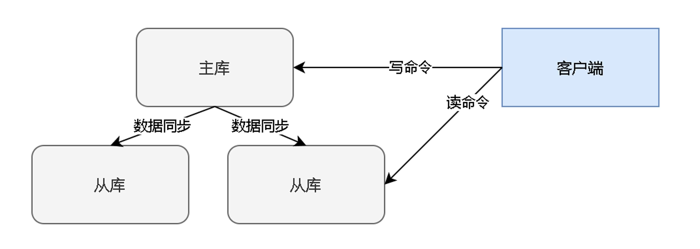

补充：首先主机把数据复制到两个从机，然后构成主从复制架构。


#### 6.2 主从复制流程

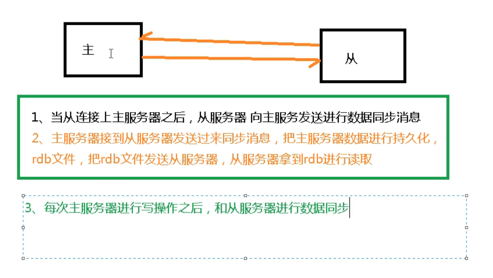

补充：

1. 全量复制：slave服务器在接收到数据库文件数据后，将其存盘并加载到内存中。

2. 增量复制：Master服务器继续将新的所有收集到的修改命令依次传给slave,完成同步。


#### 6.3 哨兵机制

**原理**

哨兵会监控所有的主机和从机。哨兵每隔1s会向所有的主机发送ping命令，当主机收到命令时，会发送一个响应给哨兵，如果没有收到命令，哨兵则判定主机下线，然后进行投票，从所有的从机中挑出一个从机作为主机。如果主机又上线了，现在的主机会变成从机。


### 7. 集群

**为什么需要集群？**

对主机的写操作容易导致主机的负荷较大，所以需要多个主机从而形成一个集群。


**redis3.0 提供解决方案：中心化集群配置**

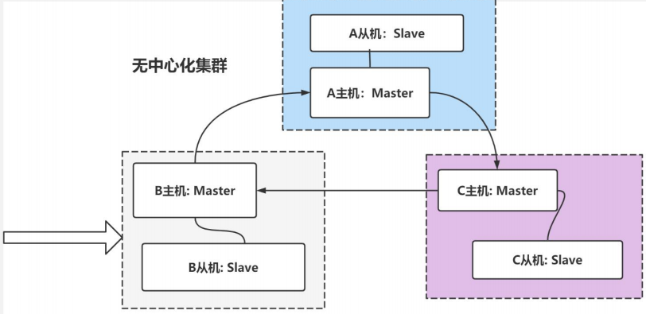

(1)各个Redis 服务仍然采用主从结构。

(2)各个Redis 服务是连通的。

(3)这种方式，就无中心化集群配置，可以看到，只需要 6 台服务器即可搞定。

(4)无中心化集群配置还会根据key值计算slot ,把数据分配到不同的主机,从而缓解单个主机的存取压力。

例子：set key name 通过key来计算slot，从而把数据分配到对应的主机。

**什么是slot？**

一个Redis集群包含16384个插槽（hash slot），编号从 0-16383, Reids中的每个键都属于这 16384 个插槽的其中一个。

**集群使用公式crc16(key)%16384来计算key属于哪个槽。**

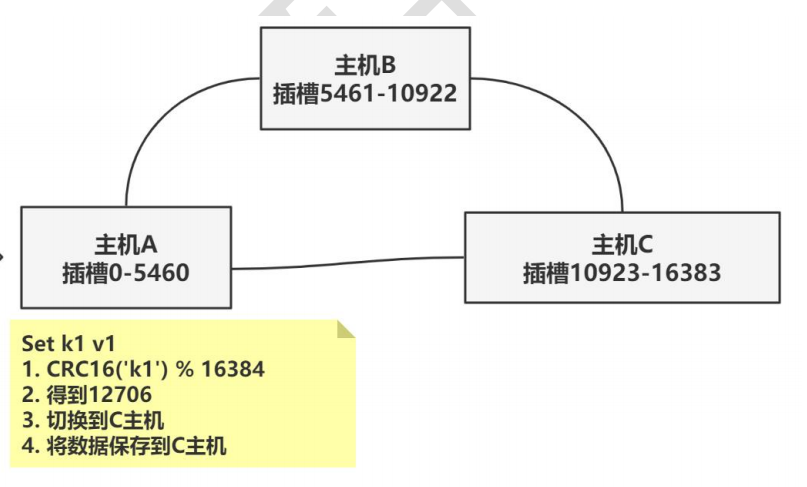

**redis集群故障恢复**

1. 如果主节点下线，从节点会自动升为主节点。
2. 主节点恢复后，主节点会变成从机。


**强调：无中心化主从集群，无论从哪台主机写数据，其他主机都能读到数据。**


### 8. 缓存

#### 8.1 缓存穿透

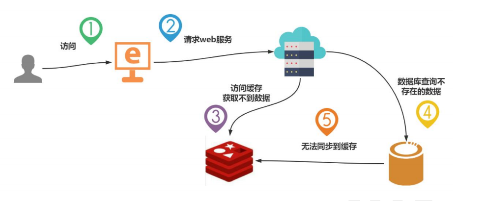

**缓存穿透的定义：查询缓存和数据库中不存在的数据，导致服务器压力过大。**


**缓存穿透的现象**

(1)应用服务器压力变大。

(2)redis命中率过低。

(3)一直查数据库。


**解决方案**

（1） **对空值缓存：**如果一个查询返回的数据为空（不管是数据是否不存在），我们仍然把这个空结果（null）进行缓存，设置空结果的过期时间会很短，最长不超过五分钟

（2） **设置可访问的名单（白名单）：**定义一个可以访问的名单，每次访问和白名单的 id 进行比较，如果访问 id 不在白名单里面，进行拦截，不允许访问, 可以通过 bitmaps 实现.

（3） **采用布隆过滤器(有点类似于一个白名单)**：布隆过滤器可以用于检索一个元素是否在一个集合中。将所有可能存在的数据哈希到一个足够大的bitmaps中，一个一定不存在的数据会被 这个bitmaps拦截掉，从而避免了对底层存储系统的查询压力。

（4） **进行实时监控：**当发现Redis的命中率开始急速降低，需要排查访问对象和访问的数据，和运维人员配合，可以设置黑名单限制服务。


#### 8.2 缓存击穿

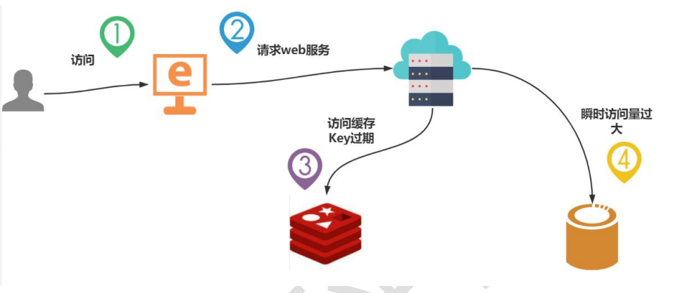

**缓存击穿的定义：key对应的数据存在，但在redis中过期，此时若有大量并发请求过来，这些请求发现缓存过期一般都会从后端DB加载数据并回设到缓存，这个时候大并发的请求可能会瞬间把后端DB压垮。**


**解决方案**

（1）预先设置热门数据。在redis高峰访问之前，把一些热门数据提前存入到redis里面，加大这些热门数据key的时长。

（2）实时调整。现场监控哪些数据热门，实时调整key的过期时长。

（3）当访问缓存失效后，加上一个锁，从而减少数据库接收数据的并发量。

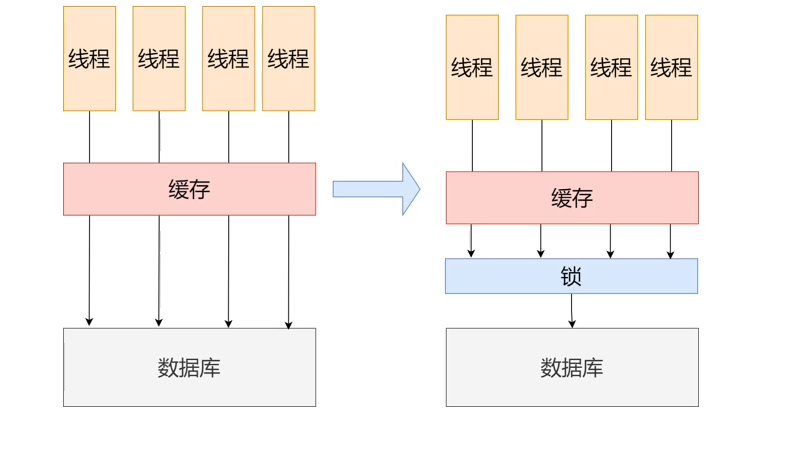


#### 8.3 缓存雪崩

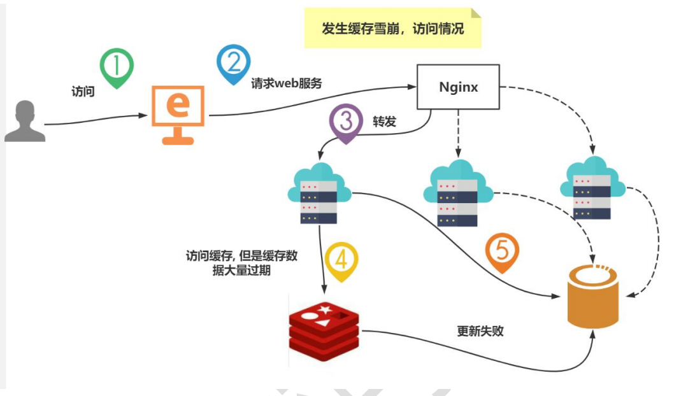

**缓存雪崩的定义：**key**对应的数据存在，但在** **redis** **中过期，此时若有大量并发请求过来，这些请求发现缓**

**存过期一般都会从后端** **DB** **加载数据并回设到缓存。**


**缓存雪崩的现象**

（1）数据库访问压力变大，数据库崩溃。

（2）大量的key过期。


**缓存雪崩的解决方案**

（1）构建多级缓存架构。nginx缓存 + redis缓存 +其他缓存（ehcache等）

（2）当访问缓存失效后，加上一个锁，从而减少数据库接收数据的并发量。

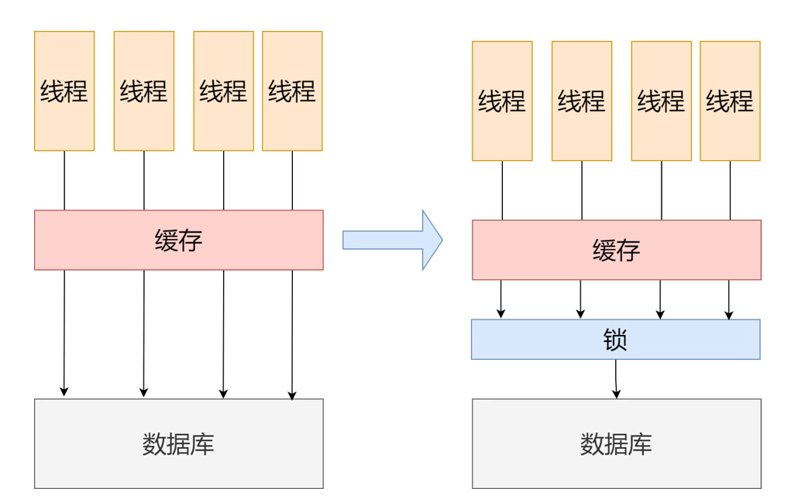

（3）将缓存失效时间分散开

我们可以在原来的失效时间的基础上增加一个随机值，这样就很难引发集体失效的事件。

（4）设置过期标志更新缓存

记录缓存数据是否过期，如果过期会通过后台去更新key的实际内存，也就是删除key。
