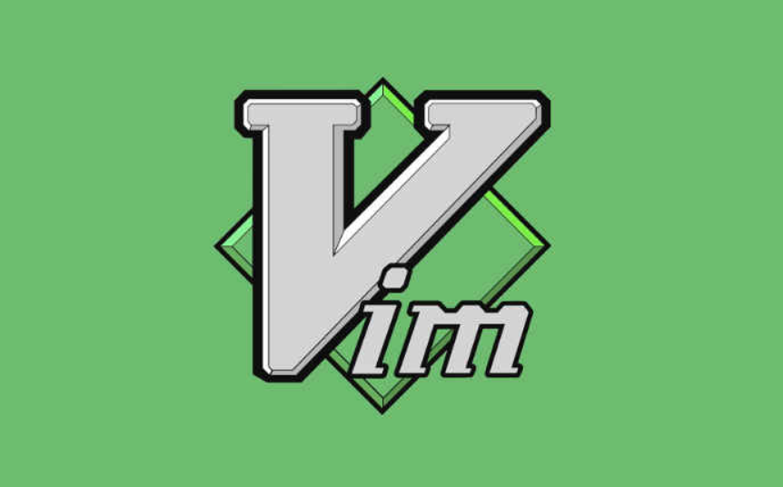

## tmux和vim入门

### tmux的使用

**1. tmux是什么？**

Tmux 是一个终端复用器（terminal multiplexer），非常有用，属于常用的开发工具。


**2. 会话和进程**

打开一个终端窗口（terminal window，以下简称"窗口"），在里面输入命令。**用户与计算机的这种临时的交互，称为一次"会话"（session）** 。

**3. 会话操作**

应为购买的腾讯云服务器里面默认安装了tmux。

```
# 进入了tmux窗口
tmux

# 退出 Tmux 窗口
exit
```

**4. 窗格操作**

```
# 划分左右两个窗格
tmux split-window -h

# 退出窗格
exit

# tmux中复制命令行
先按住shift键然后拖动鼠标

# tmux中复制文档中的文字
直接拖动鼠标
```

### vim的使用

**1. vim是什么？**

Vim 是最重要的编辑器之一，主要有下面几个优点。

- 可以不使用鼠标，完全用键盘操作。

- 系统资源占用小，打开大文件毫无压力。

- 键盘命令变成肌肉记忆以后，操作速度极快。

- 服务器默认都安装 Vi 或 Vim。

  

**3. vim的三种模式**

1. 一般命令模式：ESC，默认打开一个文件就是在一般命令模式下。

2. 编辑模式：i 是在行头插入。
3. 命令行模式：: / ? 三个字母中的任意一个可以进入命令行模式，通常是做一些 vim 配置、查找、替换、保存退出等。

**4. vim命令**

```
# 移动命令
方向键

# 复制粘贴文本
拖动鼠标 ctrl+insert复制文本 shift+insert粘贴文本

# 文本操作
:wq!强制退出

# 显示行号
:set nu
```

