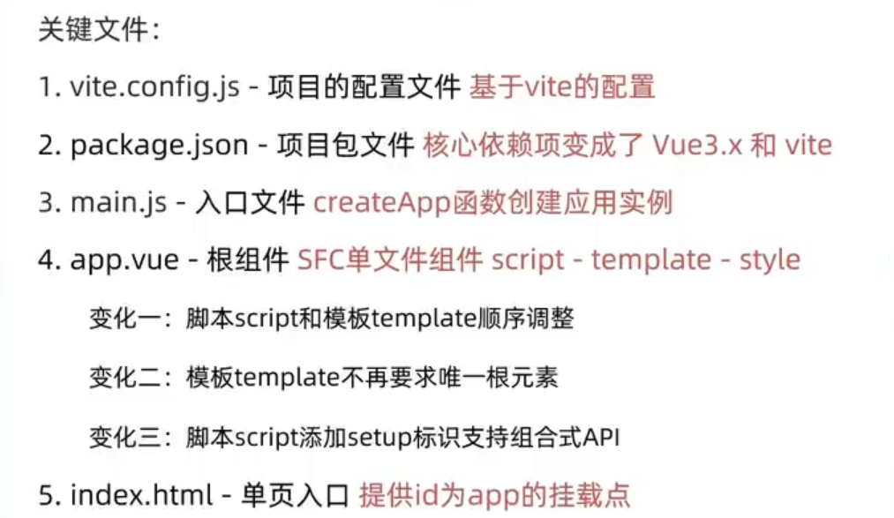
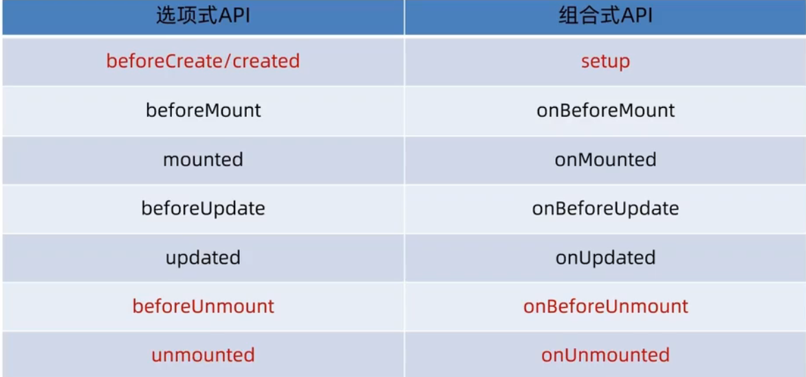
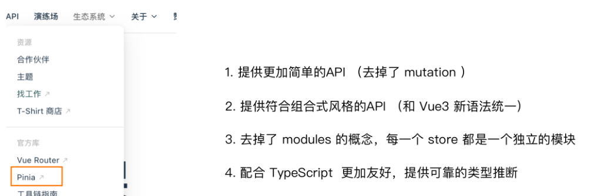

## 1. 创建项目

> 前置条件 - 已安装16.0或更高版本的Node.js

执行如下命令，这一指令将会安装并执行 create-vue

```bash
npm init vue@latest
```

执行如下命令，这一指令将会运行vue项目

```bash
npm install
```

```bash
npm run dev
```

## 2. 项目基本结构




## 3. 组合式API-setup选项

```vue
<script>
  export default {
    setup(){
      
    },
    beforeCreate(){
      
    }
  }
</script>
```

> 因为setup执行在beforeCreate之前，所以setup函数没有实例。


setup语法糖

```vue
<script setup>
  const message = 'this is message'
  const logMessage = ()=>{
    console.log(message)
  }
  /*return语句省略
  return {
        message,
        logMessage
      }*/
</script>
```


## 4. reactive和ref

### reactive

> 接受对象类型数据的参数传入并返回一个响应式的对象

```vue
<script setup>
 // 导入
 import { reactive } from 'vue'
 // 执行函数 传入参数 变量接收
 const state = reactive({
   msg:'this is msg'
 })
 const setSate = ()=>{
   // 修改数据更新视图
   state.msg = 'this is new msg'
 }
</script>

<template>
  {{ state.msg }}
  <button @click="setState">change msg</button>
</template>
```

### ref

> 接收简单类型或者对象类型的数据传入并返回一个响应式的对象

```vue
<script setup>
 // 导入
 import { ref } from 'vue'
 // 执行函数 传入参数 变量接收
 const count = ref(0)
 const setCount = ()=>{
   // 修改数据更新视图必须加上.value
   count.value++
 }
</script>

<template>
	//template标签中的响应式属性不用加上value
  <button @click="setCount">{{count}}</button>
</template>
```


### reactive 对比 ref

1. 都是用来生成响应式数据
2. 不同点
   1. reactive不能处理简单类型的数据
   2. ref参数类型支持更好，但是必须通过.value做访问修改
   3. ref函数内部的实现依赖于reactive函数


**直接使用ref，别使用reactive**


## 5. computed

```vue
<script setup>
import { ref, computed } from "vue";
let a = ref([1, 2, 3, 4, 5]);
//筛选出元素大于2的数组
const filterArr = computed(function () {
  return a.value.filter((item) => item > 2);
});
</script>

<template>
  <div>修改之前的数组：{{ a }}</div>
  <br />
  <div>修改之后的数组：{{ filterArr }}</div>
</template>

<style></style>
```


## 6. watched

>侦听一个或者多个数据的变化，数据变化时执行回调函数，俩个额外参数 immediate控制立刻执行，deep开启深度侦听。

### 侦听单个数据

```vue
<script setup>
import { ref, watch } from "vue";
const count = ref(0);

watch(count, (newValue, oldValue) => {
  console.log(`count changed from ${oldValue} to ${newValue}`);
});
</script>

<template>
  <div>{{ count }}</div>
  <button @click="count++">增加</button>
</template>

<style></style>
```


### 侦听多个数据

> 侦听多个数据，第一个参数可以改写成数组的写法

```vue
<script setup>
import { ref, watch } from "vue";
const count = ref(0);
const name = ref("张三");

watch([count, name], (newValue, oldValue) => {
  console.log(`count changed from ${oldValue} to ${newValue}`);
});
</script>

<template>
  <div>{{ count }}</div>
  <button @click="count++">增加</button>

  <div>{{ name }}</div>
  <button @click="name = '李四'">修改</button>
</template>

<style></style>
```

### deep

> 通过watch监听的ref对象默认是浅层侦听的，直接修改嵌套的对象属性不会触发回调执行，需要开启deep

```vue
<script setup>
import { ref, watch } from "vue";
let person = ref({
  name: "张三",
  age: 18,
});

watch(
  person,
  (oldValue, newValue) => {
    console.log(oldValue, newValue);
  },
  { deep: true }
);
</script>

<template>
  <div>{{ person.age }}</div>
  <button @click="person.age++">增加</button>

  <div>{{ person.name }}</div>
  <button @click="person.name = '李四'">修改</button>
</template>

<style></style>
```


## 7. 生命周期




## 8. 父子通信

### 父传子

> 基本思想
>
> 1. 父组件中给子组件绑定属性
> 2. 子组件内部通过props选项接收数据

App.vue

```vue
<script setup>
import Son from "./components/sonCom.vue";
import { ref } from "vue";
let money = ref(1000);
</script>

<!-- 父组件 -->
<template>
  <div id="app">
    <div>父亲的工资:{{ money }}元</div>
    <br />

    <button @click="money++">赚钱</button>
    <br />

    <Son :money="money"></Son>
  </div>
</template>

<style></style>
```

sonCom.vue

```vue
<script setup>
const props = defineProps({
  money: Number,
});
console.log(props.money);
</script>

<template>
  <div class="son">父亲留给儿子的遗产:{{ money }}元</div>
</template>

<style scoped>
.son {
  border: 1px solid black;
  padding: 10px;
}
</style>

```

### 子传父

> 基本思想
>
> 1. 父组件中给子组件标签通过@绑定事件
> 2. 子组件内部通过 emit 方法触发事件

App.vue

```vue
<script setup>
import Son from "./components/sonCom.vue";
import { ref } from "vue";
let money = ref(1000);
const spendmoney = (value) => {
  money.value -= value;
};
</script>

<!-- 父组件 -->
<template>
  <div id="app">
    <div>父亲的工资:{{ money }}元</div>
    <br />

    <button @click="money++">赚钱</button>
    <br />

    <Son :money="money" @spendmoney="spendmoney"></Son>
  </div>
</template>

<style></style>
```

sonCom.vue

```vue
<script setup>
import { defineProps, defineEmits } from "vue";
const props = defineProps({
  money: Number,
});
console.log(props.money);
const emit = defineEmits(["spend"]);
const spend = () => {
  //需要emit来触发事件
  //spendmoney是事件名，1是参数
  //因为不能对props.money进行算数运算。所以要获取父组件的元素值。
  emit("spendmoney", 1);
  console.log("花钱了");
};
</script>

<template>
  <div class="son">儿子的零花钱:{{ money }}元</div>
  <br />
  <button @click="spend">花钱</button>
</template>

<style scoped>
.son {
  border: 1px solid black;
  padding: 10px;
}
</style>
```


## 9. provide和inject

### 跨层传递响应式数据

> 实现步骤
>
> 1. 顶层组件通过 `provide` 函数提供数据
> 2. 底层组件通过 `inject` 函数提供数据

App.vue

```vue
<script setup>
import { provide,ref } from 'vue';
import father from './components/fatherCom.vue'

const money = ref(1000)

provide('money',money)
</script>

<!-- 父组件 -->
<template>
  <div id="app">
    <div>爷爷的工资:{{ money }}元</div>
    <button @click="money+=100">赚钱</button>
    <br>
    <father></father>
    
  </div>
</template>

<style></style>
```


fatherCom.vue

```vue
<script setup>
import son from '../components/sonCom.vue'
</script>


<template>
  <div>爸爸</div><br>
 <son></son>

</template>

<style></style>
```


sonCom.vue

```vue
<script setup>
import { inject } from 'vue';

const money = inject('money');
console.log(money);
</script>


<template>
 <div>
  儿子的零花钱:{{money}}
 </div>
</template>

<style></style>
```


## 10. 什么是pinia

> Pinia 是 Vue 的专属的最新状态管理库 ，是 Vuex 状态管理工具的替代品




## 11. 手动添加Pinia到Vue项目

后面在实际开发项目的时候，Pinia可以在项目创建时自动添加，现在我们初次学习，从零开始：

1.  使用 Vite 创建一个空的 Vue3项目

```bash
npm init vite@latest
```

2. 按照官方文档安装 pinia 到项目中 

   ```js
   import { createApp } from 'vue'
   import { createPinia } from 'pinia'
   import App from './App.vue'
   
   const pinia = createPinia()
   const app = createApp(App)
   app.use(pinia)
   app.mount('#app')
   ```


## 12. Pinia的同步用法

App.vue

```vue
<script setup>
import { useCounterStore } from './stores/counter';
import son1 from './components/son1-com.vue'
import son2 from './components/son2-com.vue'
const CounterStore = useCounterStore()

</script>

<template>
  <div>父亲的工资：{{CounterStore.money}}元
    <button @click="CounterStore.addMoney">赚钱</button>
  </div>
  <br>
  <son1></son1>
  <son2></son2>
</template>

<style scoped>

</style>
```

son1-com.vue

```vue
<script setup>
import { useCounterStore } from '@/stores/counter';
console.log(useCounterStore)
const counterStore = useCounterStore();
console.log(counterStore)

</script>

<template>
  <div>儿子1的零花钱：{{counterStore.money}}元
   
    <button @click="counterStore.spendMoney">花钱</button>
  </div>


</template>

<style scoped>

</style>
```

son2-com.vue

```vue
<script setup>
import { useCounterStore } from '@/stores/counter';
console.log(useCounterStore)
const counterStore = useCounterStore();

</script>

<template>
  <div>儿子2的零花钱：{{ counterStore.money }}元
    <button @click="counterStore.spendMoney">花钱</button>
  </div>


</template>

<style scoped>

</style>
```


## 13. Pinia的异步用法

- 接口地址：http://geek.itheima.net/v1_0/channels
- 请求方式：get
- 请求参数：无

App.vue

```vue
<script setup>
import { useChannelStore } from './stores/channel';
const channelStore = useChannelStore();
</script>

<template>
<button @click="channelStore.getChannelList">获取频道数据</button>
<ul>
  <li v-for="item in channelStore.channelList" :key="item.id">{{ item.name }}</li>
</ul>
</template>

<style scoped>

</style>

```

channel.js

```js
import axios from 'axios'
import {defineStore} from 'pinia'
import {ref} from 'vue'

export const useChannelStore = defineStore('channel', () => {
  const channelList  = ref([])
  
  //声明操作异步数据的方法
  const getChannelList = async () => {
    //解构
    const {data:{ data }} = await axios.get('http://geek.itheima.net/v1_0/channels')
    channelList.value = data.channels
    console.log(data.channels)
  }
  return {
    channelList,
    getChannelList
  }
})
```

