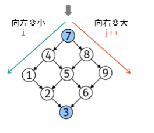

### 题目链接

https://leetcode.cn/problems/er-wei-shu-zu-zhong-de-cha-zhao-lcof/solutions/95306/mian-shi-ti-04-er-wei-shu-zu-zhong-de-cha-zhao-zuo/


### 解题思路




### 相关代码

```java
class Solution {
    public boolean findTargetIn2DPlants(int[][] plants, int target) {
        if(plants.length==0) return false;
       int i = 0,j = plants[0].length-1;
       //向左j变小，向右i变大
       while(j>=0&&i<plants.length){
           if(plants[i][j]>target){
               j--;
           }
           else if(plants[i][j]<target){
               i++;
           }
           else{
               return true;
           }
        }
        return false;
    }
}
```

