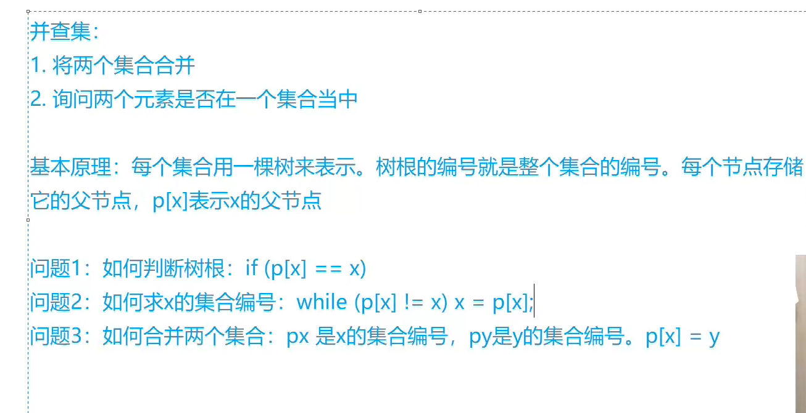

## AcWing 836. 合并集合

### 解题思路




### 相关代码

```java
import java.util.Scanner;

public class Main {
    static int p[] = new int[100010];
    public static void main(String[] args) {
        int n,m;
        Scanner scanner = new Scanner(System.in);
        n = scanner.nextInt();
        m = scanner.nextInt();
        for(int i=1;i<=n;i++) p[i] = i;
        for(int i=0;i<m;i++){
            char s = scanner.next().charAt(0);
            int a = scanner.nextInt();
            int b = scanner.nextInt();

            if(s=='M')  p[find(a)] = find(b);
            else
            if(find(a)==find(b)) System.out.println("Yes");
            else System.out.println("No");
        }
    }
    //找到编号为x的所在集合编号p[x]
    public static int find(int x){
        while(x!=p[x]) x=p[x];
        return p[x];
    }
    //判断编号为x所在的集合是否和编号为y所在的集合是一样的
    public static boolean judge(int x,int y){
        return find(x)==find(y);
    }
    //将编号x所在的集合和编号y所在的集合进行合并
    public static void merge(int x,int y){
        p[find(x)] = find(y);
    }
}
```

## Acwing 837. 连通块中点的数量

### 解题思路

和前面的题的思路非常像，除此之外加上了一个每个集合的数目并且不断地维护他们的大小。

### 相关代码

```java
import java.util.Scanner;
public class Main {
    static int p[] = new int[100010];
    static int s[] = new int[100010];
    public static void main(String[] args) {
        int n,m;
        Scanner scanner = new Scanner(System.in);
        n = scanner.nextInt();
        m = scanner.nextInt();
        for(int i=1;i<=n;i++) p[i] = i;
        for(int i=1;i<=n;i++) s[i] = 1;
        for(int i=0;i<m;i++){
            String s1 = scanner.next();
            if(s1.equals("C")){
                int a = scanner.nextInt();
                int b = scanner.nextInt();
                merge(a,b);
            }
            else if(s1.equals("Q1")){
                int a = scanner.nextInt();
                int b = scanner.nextInt();
                if(judge(a,b)) System.out.println("Yes");
                else System.out.println("No");
            }
            else{
                int a = scanner.nextInt();
                System.out.println(s[find(a)]);
            }
        }
    }

    //找到编号为x的所在集合编号p[x]
    public static int find(int x){
        if(x!=p[x])p[x]=find(p[x]);
        return p[x];
    }

    //判断编号为x所在的集合是否和编号为y所在的集合是一样的
    public static boolean judge(int x,int y){
        return find(x)==find(y);
    }

    //将编号x所在的集合和编号y所在的集合进行合并
    public static void merge(int x,int y){
        if(find(x)==find(y)) return;
        s[find(y)] = s[find(x)]+s[find(y)];
        p[find(x)] = find(y);
    }

}
```


## Acwing 1250. 格子游戏

### 解题思路

每次加一条边，好比形成一颗树的过程。也就是并查集


### 相关代码

```java
import java.util.Scanner;

public class Main {
    static int n;
    static int p[] = new int[200*200+10];
    public static void main(String[] args) {
        Scanner scanner = new Scanner(System.in);
        n = scanner.nextInt();
        int m = scanner.nextInt();
        for(int i=1;i<=n*n;i++) p[i] = i;
        int res=0;
        for(int i=1;i<=m;i++){
            int a = scanner.nextInt();
            int b = scanner.nextInt();
            int s = scanner.next().charAt(0);

            a--;
            b--;
            int s1 = get(a,b);
            int s2;
            if(s=='D'){
                s2 = get(a+1,b);
            }
            else{
                s2 = get(a,b+1);
            }
            if(find(s1)==find(s2)){
                res = i;
                break;
            }
            else{
                p[find(s2)] = s1;
            }
        }

        if(res==0) System.out.println("draw");
        else System.out.println(res);
    }

    public static int get(int x,int y){
        return x*n+y;
    }

    public static int find(int x){
        if(p[x]!=x) p[x] = find(p[x]);
        return p[x];
    }
}
```


## Acwing 1252. 搭配购买

### 解题思路

将这些点形成一些联通块，然后又转化成01背包问题。

### 相关代码

```java
import java.util.Scanner;

public class Main {
    static int p[] = new int[10010];
    static int c[] = new int[10010];
    static int d[] = new int[10010];
    static int f[] = new int[10010];
    public static void main(String[] args) {
        Scanner scanner = new Scanner(System.in);
        int n = scanner.nextInt();
        int m = scanner.nextInt();
        int w = scanner.nextInt();
        for(int i=1;i<=n;i++) p[i] = i;
        for(int i=1;i<=n;i++){
            c[i] = scanner.nextInt();
            d[i] = scanner.nextInt();
        }

        for(int i=1;i<=m;i++){
            int a = scanner.nextInt();
            int b = scanner.nextInt();

            int pa = find(a),pb = find(b);
            if(pa!=pb){
                c[pb] = c[pb]+c[pa];
                d[pb] = d[pb]+d[pa];
                p[pa] = pb;
            }
        }

        //01背包问题
        for(int i=1;i<=n;i++){
            //遍历根节点
            if(i==p[i])
            for(int j=w;j>=c[i];j--){
                f[j] = Math.max(f[j],f[j-c[i]]+d[i]);
            }
        }

        System.out.println(f[w]);
        
    }

    public static int find(int x){
        if(p[x]!=x) p[x] = find(p[x]);
        return p[x];
    }
}
    
```

