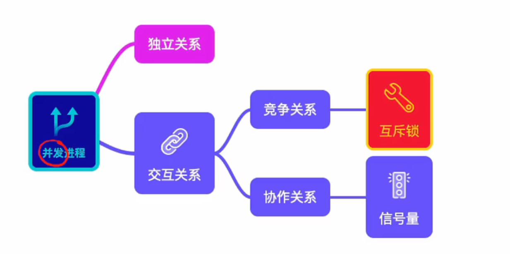
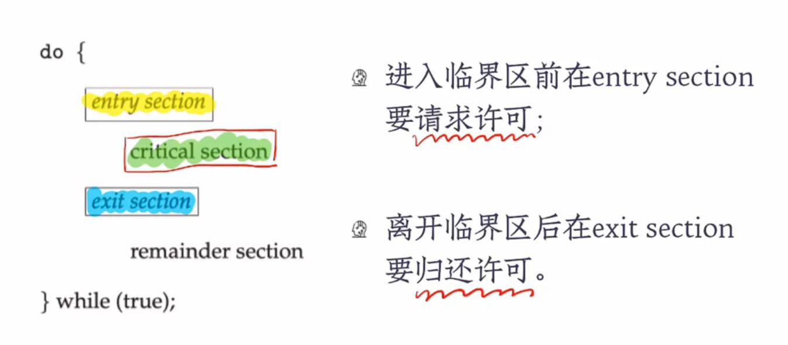
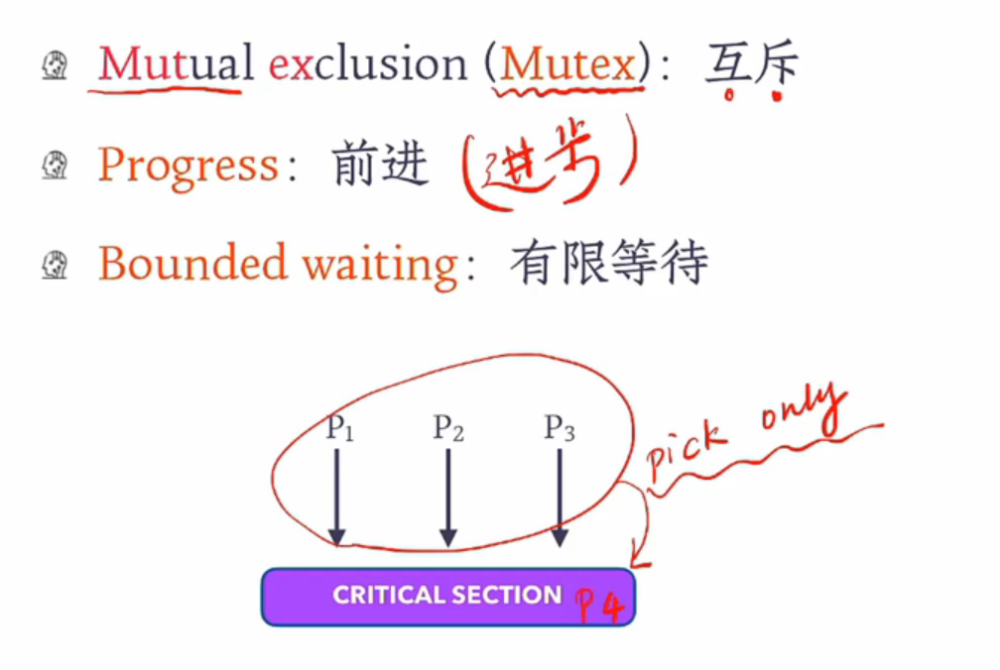
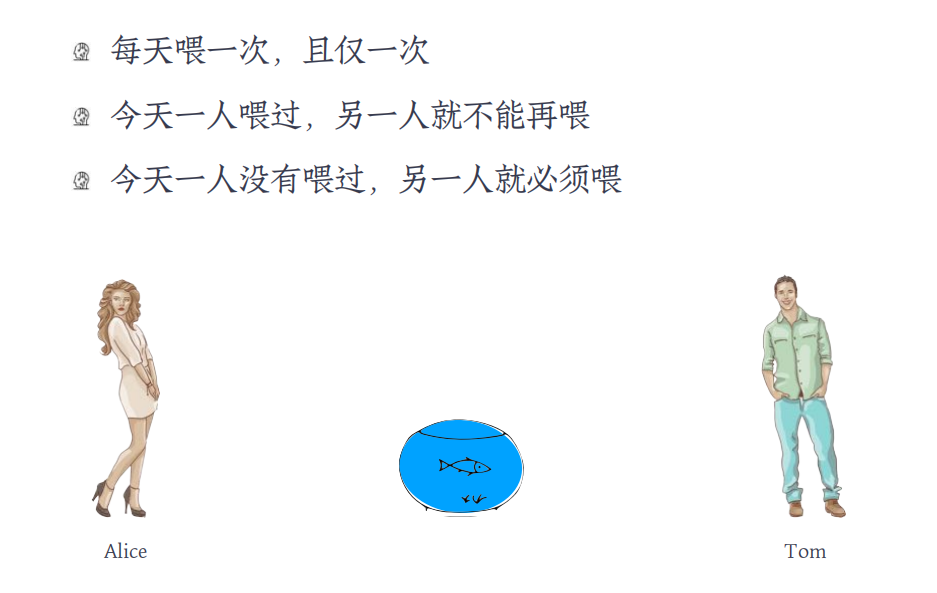
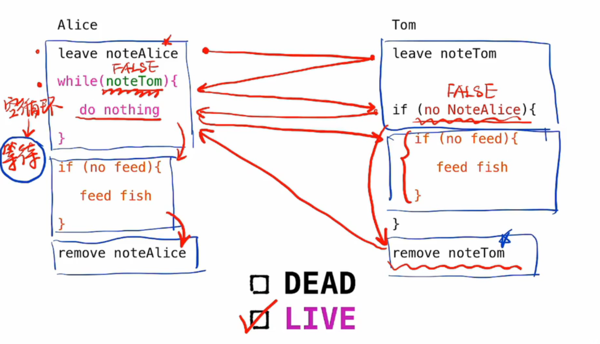
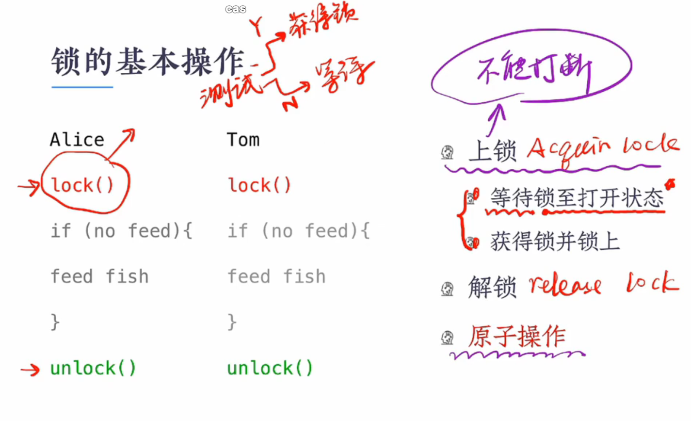

## review

## 临界区问题

###  临界区问题

（1）每个并发进程都有一段代码，称为临界区，在这段代码中，进程可能会更改公共变量、更新表格、写入文件等等。

（2）临界区的重要特征是当一个进程在临界区执行时，	不允许其他进程在临界区执行。

（3）临界区问题在于设计一种进程可以用来协作的协议。

### 进程进出临界区协议

### 临界区管理准则

补充：

互斥：临界区中只能有一个进程。

有限等待：当临界区内有一个进程执行时，其他进程需要在临界区外等待，但也不会一直等待，而是有限等待。

总结：

(可以想象成上厕所)

有空让进

择一进入

无空等待

有限等待

让权等待

## 喂养金鱼

### 金鱼生存法则

### 最终代码

### 解决临界区管理

（1）两个进程的实现代码是不对称的，当处理超过2个进程的时候，代码的复杂度会变得更大 。

（2）实现需要较高的编程技巧 。

## 互斥锁

### 互斥锁

（1）操作系统设计者构建软件工具来解决临界区问题。其中最简单的工具就是互斥锁。

（2）一个进程在进入临界区之前必须获取该锁。

（3）当进程退出临界区时，必须释放该锁。

### 锁的基本操作

### 原子操作（原语）

（1）原子操作的意思是不可被中断。

（2）原子操作（原语）是操作系统重要的组成部分，下面两天硬件指令都是原子操作，他们可以用来对临界区的管理。（也就是锁）

test_and_set()	compare_and_swap()

### 忙式等待

（1）忙式等待是指占用CPU执行空循环实现等待 。

（2）这种类型的互斥锁也被称为“自旋锁”(spin lock) 。

（3）缺点：浪费CPU周期，可以将进程插入等待队列以让出CPU的使用权； 

（4）优点：进程在等待时没有上下文切换，对于使用锁时间不长的进程，自旋锁还是可以接受的；在多处理器系统中，自旋锁的优势更加明显。