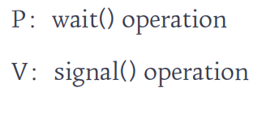
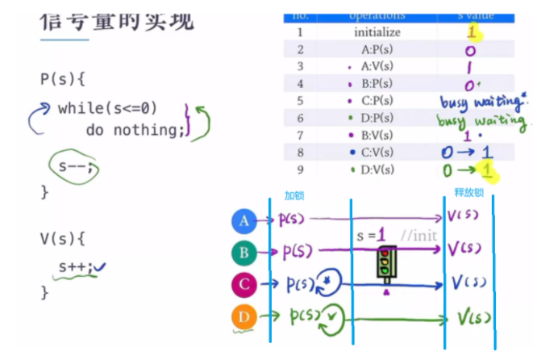
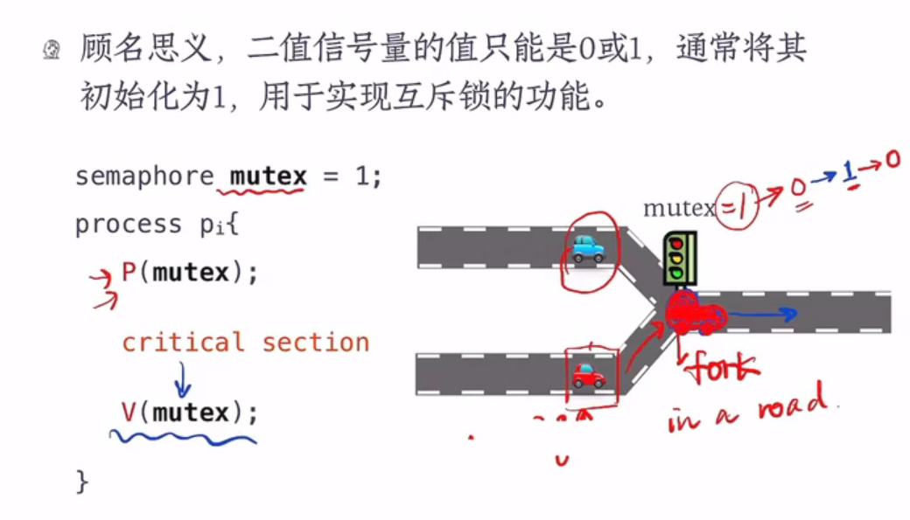
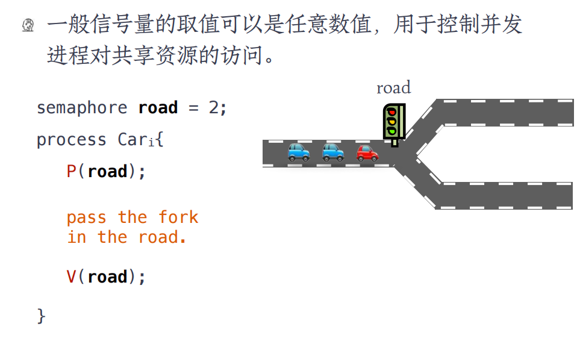

## 信号量和PV操作

### 信号量

（1）信号量（Semaphore）是一种比互斥锁更强大的同步工具，它可以提供更高级的方法来同步并发进程。 

（2）信号量 S 是一个整数变量，除了初始化之外，只能通过两个标准的原子操作来访问它：P（荷兰语中的“测试”）和 V（荷兰语中的“增加”）。

### 信号量的实现

## 信号量的使用

### 二值信号量

### 一般信号量

补充：信号量可以表示可用的资源数。