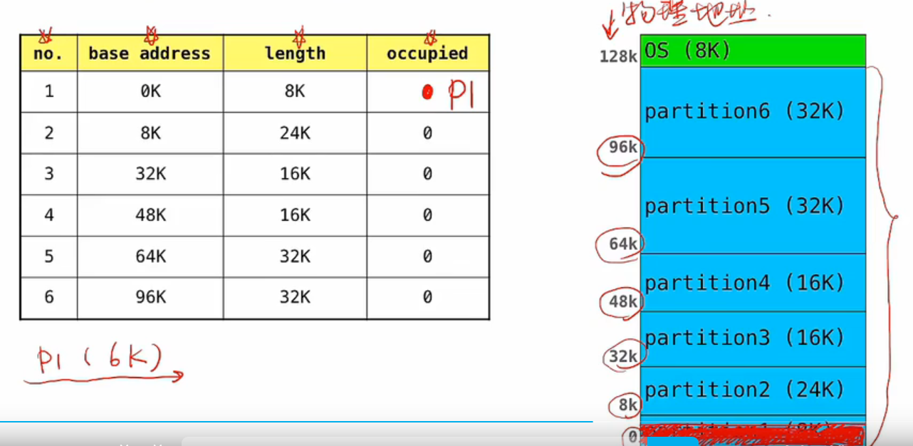

## 内存管理目标

### 主存

（1）主存是计算机系统的一个核心部件。

（2）内存由大量的字节数组组成，每个字节都有自己的地址。

（3）CPU 根据程序计数器（PC）的值从内存中获取指令。

（4）一个指令首先从内存中获取一条指令，然后对该指令进行解码，然后从内存中取出操作数，然后对操作数执行指令后，然后将结果放入到内存中。

### 高速缓冲存储器

高速缓存是一种存取速度比内存快，但容量比内存小的多的存储器，它可以加快访问物理内存的相对速度。

## 逻辑地址和物理地址

### 地址空间和地址转换

### 内存管理单元MMU

MMU完成逻辑地址到物理地址运行时的转换工作。

## 连续内存分配

### 连续内存分配

在连续内存分配中，每个进程都包含在内存的一个单独的空间中，该空间与包含下一个进程空间相邻。

### 固定大小分区

内存被预先划分成若干个固定大小的分区，每个分区只能容纳一个进程。

### 可变大小分区

（1）在可变分区方案中，操作系统保存两张表，表明内存的哪些部分是可用的，哪些部分是已被占用的。

### 动态存储分配问题

1. 首次适应算法（First Fit）

2. 邻近适应算法（Next Fit）
3. 最坏适应算法（Next Fit）
4. 最佳适应算法（Best Fit）

 ### 碎片

一些不可以使用的内存碎片。