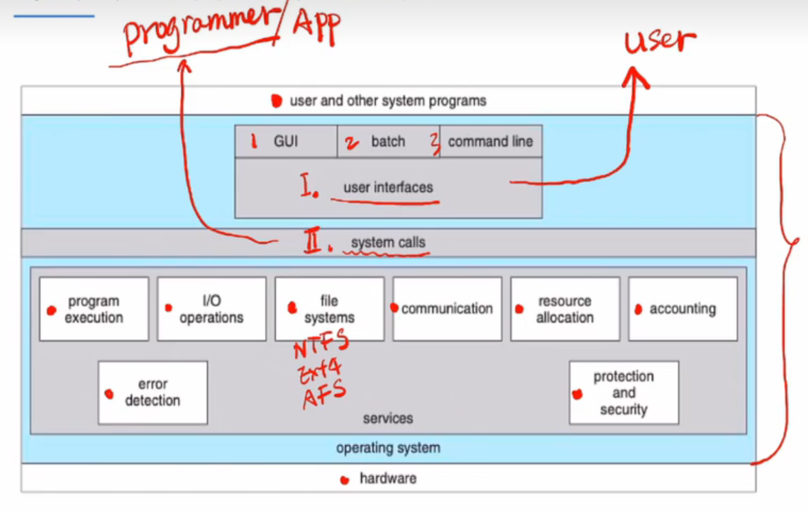

## 操作系统的服务

### 操作系统提供哪些服务？

user interface是面向用户的接口。

system calls是面向程序员的接口(用户程序的接口)，也叫做系统调用。

### user interface(用户接口)

（1）cli(command line interfce) 命令行接口

（2）gui(graphic  user interface) 图形化用户接口

（3）batch 批处理文件

### system calls(系统调用)

系统调用的定义：系统调用提供了访问和使用操作系统所提供的服务的接口。 换句话说就是程序员想要控制操作系统或者获取操作系统中的某项服务，需要通过系统调用来完成。

### Api

api的定义：指明了参数和返回值的一组函数。

应用程序App的开发人员通过透过API间接访问了系统调用。

对上述这句话举一个例子。

printf是stdio提供的api。printf函数的调用引发了对应系统调用write的执行。write执行结束时的返回值返回给用户程序。

### 双重模式

（1）用户态

在用户态下，通常执行用户应用程序。

（2）核心态

在核心态下，通常执行系统应用程序。

实现方式：

用一个硬件模式位来表示当前模式：0表示内核模式，1表示用户模式。

### 运行模式的切换

（1）系统调用需要再哪种模式下执行？

核心模式

（2）应用程序运行在哪种模式下？

核心模式

（3）调用api函数printf时，模式如何切换？

通过系统调用后，进行陷阱机制，然后加码，还原成用户模式。

### 系统调用的实现机制

