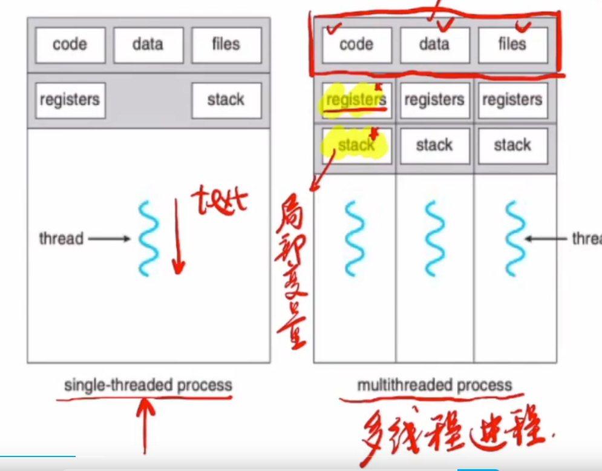
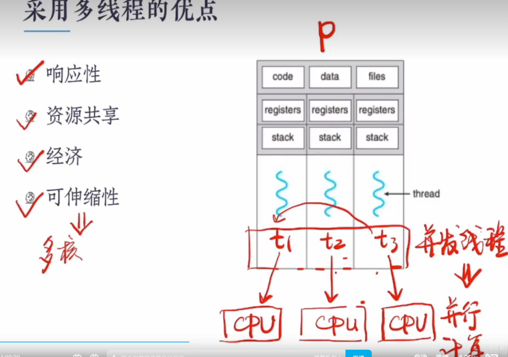
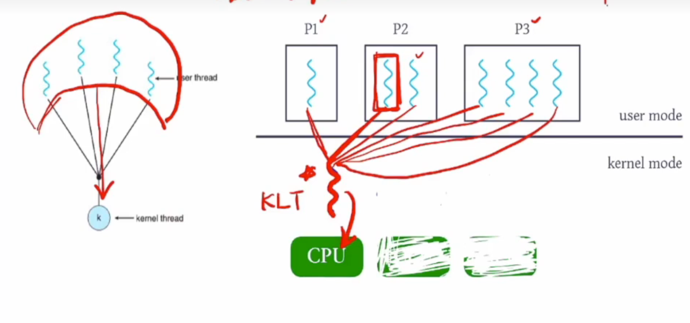
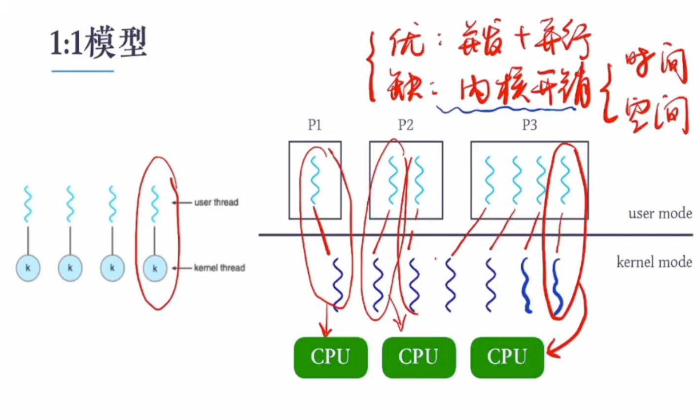
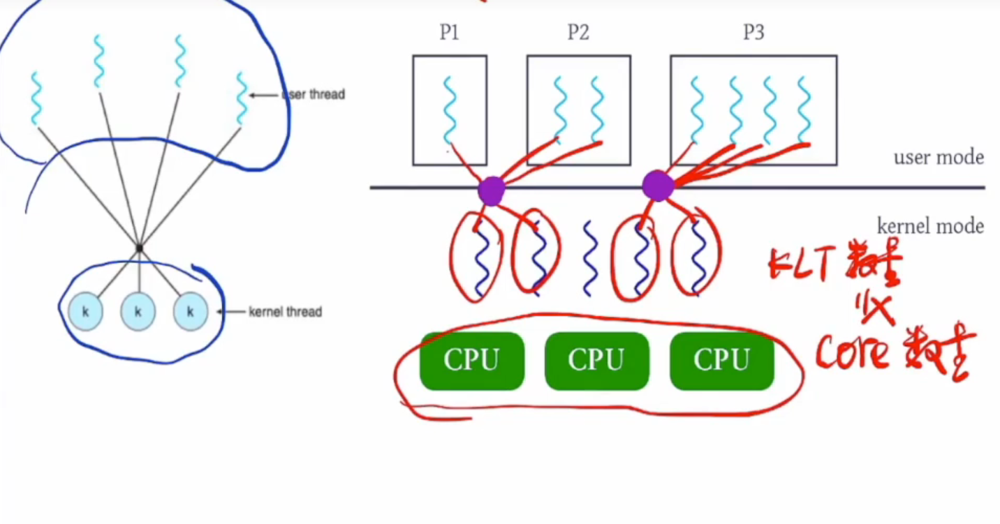

## 线程的定义

（1）一个应用通常需要很多工作，比如一个qq程序，可能需要打开聊天室，可能需要打开qq空间，这些同时执行的任务可称为执行流，这些执行流是并发执行的。

（2）进程中的一个执行流叫做一个线程。

### 单线程进程和多线程进程的结构图

### 多线程的优点：

补充：可伸缩性表示的是多线程支持单核和多核。

响应性：进程与进程之间的通信比较麻烦，因为他们的资源不共享。进程内线程与线程的资源共享，所以他们之间的通信比较方便。所以具有响应性。

### 总结：

（1）一个线程是cpu调度单位的基本单元。进程由线程id，程序计数器，寄存器集合，和栈。

（2）它和其他进程共享资源。

（3）传统的进程有一个执行流。对于多线程进程来说，它可以在同一时间执行多个任务。

## 多线程模型

### 多核编程

在多处理器系统中，多核线程机制让应用程序的多个执行任务分到不同的处理器上运行，以实现并行运算。

### 用户线程和多核线程

用户线程：用户线程在用户模式下运行。

内核线程：内核线程在内核模式下运行。

### M:1模型

该模型的优点：多执行流并发操作。

该模型的缺点：一个用户线程只能占领一个内核线程。

### 1:1模型

1:1模型的优点：多执行流进行并行运算。

1:1模型的缺点：资源开销大。

### M:M模型

M:M模型的优点：节约内核开销。

M:M模型的缺点：实现起来比较复杂。

### 线程库

Thread Library为程序员提供创建和管理线程的API 

（1）POSIX Pthreads：用户线程库和内核线程库 

（2）Windows Threads：内核线程库 

（3）Java Threads：依据所依赖的操作系统而定