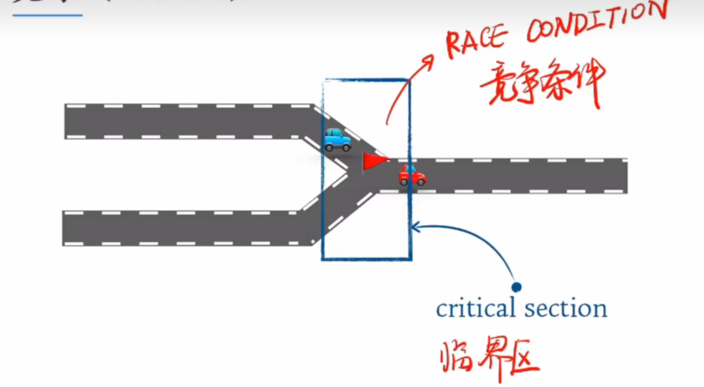

## 并发

### 并发进程/线程

（1）在内存中同时存在的若干个进程/线程，由操作系统的调度程序采用适当的策略将他(们)调度至CPU(s)上

运行，同时维护他们的状态队列。 

（2）多个并发进程/线程从宏观上是同时在运行。

（3）从微观上看，他们的运行过程是走走停停。

（4）并发的进程/线程之间是交替执行（Interleaving）。 

补充：此后课中不再刻意区分并发进程和并发线程，他们都可以理解为运行的实体和调度的单位。

### 并发进程之间的关系

1. 独立关系

   并发进程分别在自己的变量集合上运行。例如：chrome进程和music进程。

   

2. 交互关系

   并发进程执行过程中需要共享或是交换数据。例如：银行交易服务器上的receiver进程和handler进程。

补充：交互的并发进程之间存在竞争和协作的关系。

## 竞争

### 竞争

   ### 协作

   

## 异步产生的错误

### 异步

（1）异步的意思就是随机。

（2）异步会引发竞争条件：多进程进行并发操作同一数据，结果依赖特定的执行顺序。

   ## 同步

补充：异步是为了解决独立产生的问题。同步是为了解决竞争和协作产生的问题。