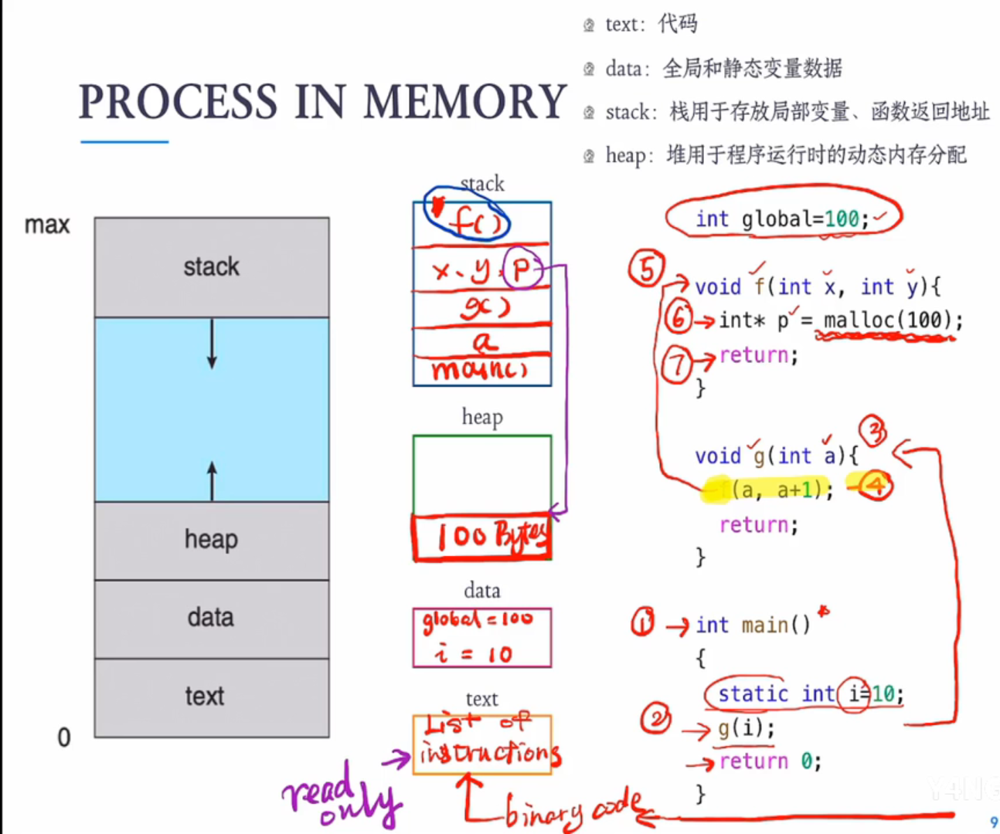
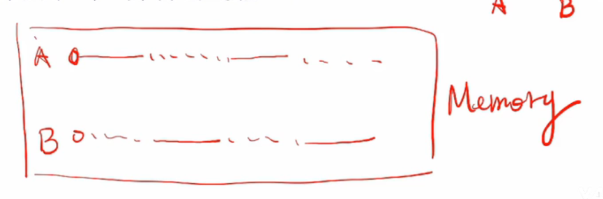
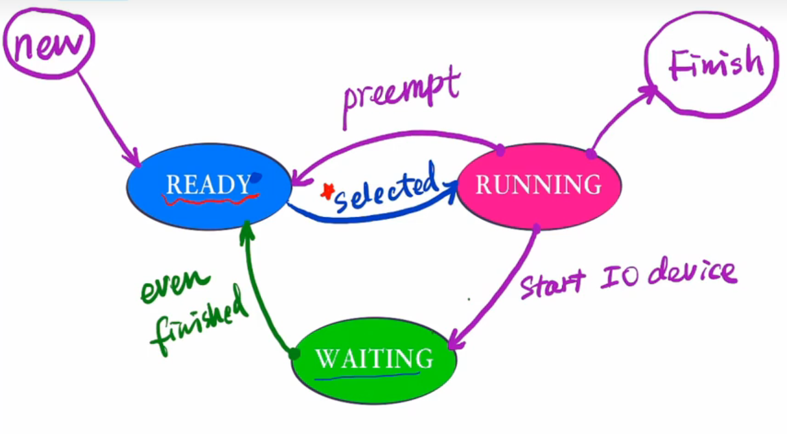

## 进程的定义

### 程序和进程

（1）一个程序就是一个可执行文件，这个可执行文件包含了一系列指令。

（2）当程序加载进内存时，一个程序将变成一个进程。

（3）一个程序包含了程序计数器。当一个程序加载到内存时，程序计数器指向了第一条指令，此时的程序变成了进程。

### 程序计数器

1. 程序计数器（PC）是一个CPU中的寄存器，里面存放下一条要执行指令的内存地址。
2. CPU在取完一条指令之后会将PC寄存器的值加“1”，以计算下条要执行指令的地址。

### 内存中的进程

补充：当第七步执行后，stack中的f()清除。

### 并发的进程

（1）并发的定义：多个任务在同一时间段内交替执行。实际上在某一时刻只有一个任务在执行。

（2）并发和并行的区别：

（3）并发是多个任务在同一时间段交替执行，并行是多个任务在同一时刻运行。

（4）进程并发的概念来源于多道程序设计。

（5）为什么不叫并行的进程？

进程a和进程b共享一个cpu，cpu只能为一个进程服务。

## 进程的状态

### 进程状态

（1）运行态：此时进程的代码在cpu上进行。

（2）就绪态：进程具备运行条件，等待分配CPU。

（3）等待态(阻塞态)：进程在等待某些事件的发生，此时的进程不具备运行条件。

### 进程何时离开CPU

（1）内部事件

进程主动放弃CPU，进入等待状态。

例子：进程执行io指令，进程主动脱离cpu。

（2）外部事件

进程被剥夺CPU使用权，进入就绪状态。

例子：时间片到达，高优先权进程到达。

### 进程状态的转换

补充：new是新建状态；finish是终止状态