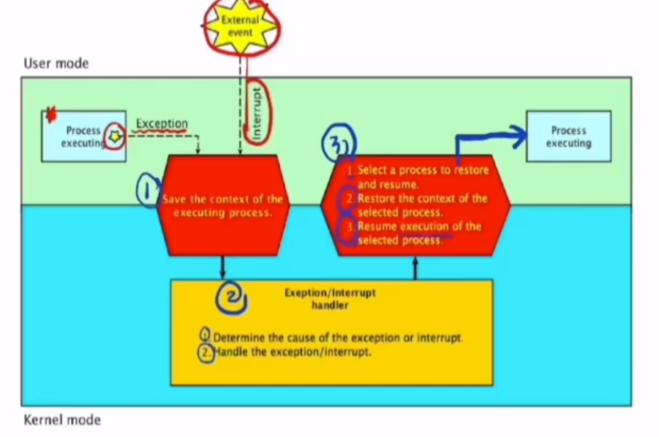
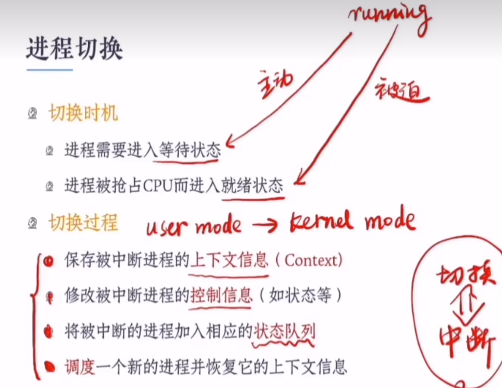

## 进程切换

### 并发进程的切换

### 中断技术

补充：中断技术采用了陷阱机制。系统调用采用了陷阱机制。从而推出系统调用采用了中断技术。

### 中断源

### 中断处理过程

补充：进程执行的过程中，可能会发生异常或者中断。然后在内核中，判断异常或者终端的原因。然后处理异常或者中断程序。然后返回到进程中断的地方继续执行。

### 特权指令和非特权指令

特权指令的定义：只能在内核模式下运行的指令叫做特权指令。

非特权指令的定义：只能在用户模式下运行的指令叫做非特权指令。

### 模式切换

### 进程切换

补充：进程在运行状态时，用完了时间片，则会从运行状态转变成等待状态。

### 进程控制块

### 进程队列

就绪队列、等待队列、那为什么没有运行队列？

答：一个进程只能在cpu上运行，不能多个。

### 进程调度

